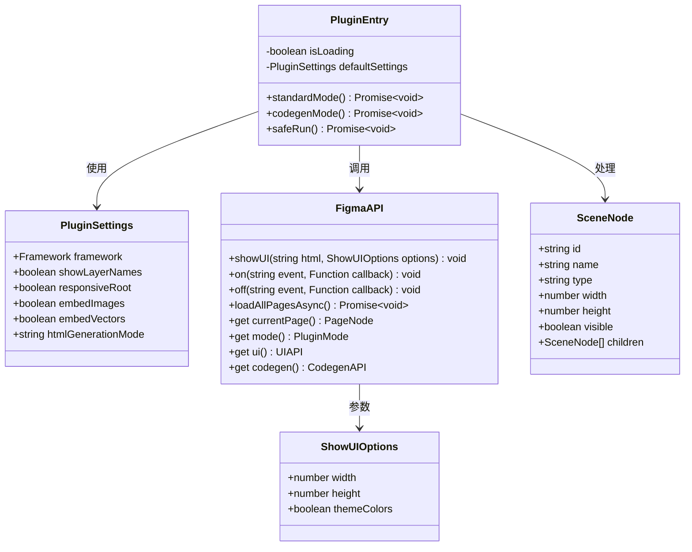
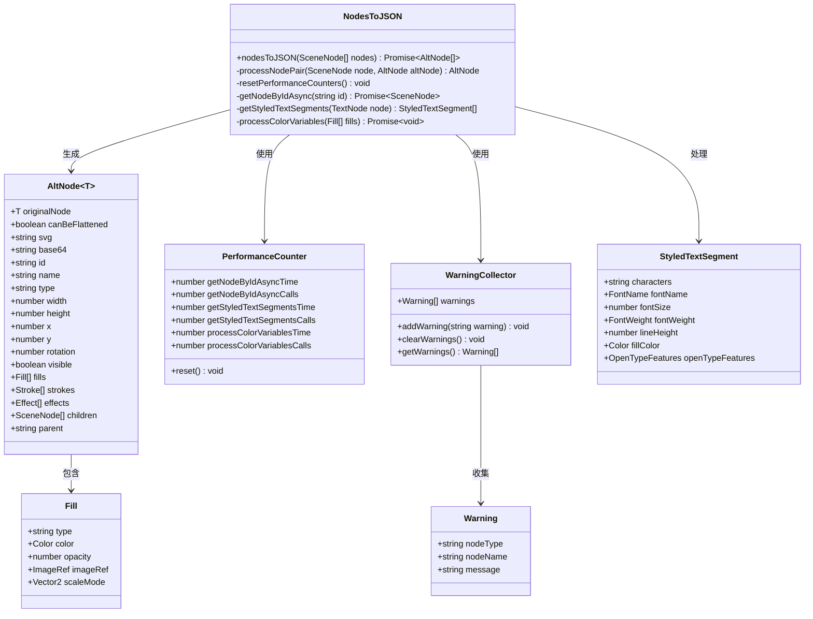
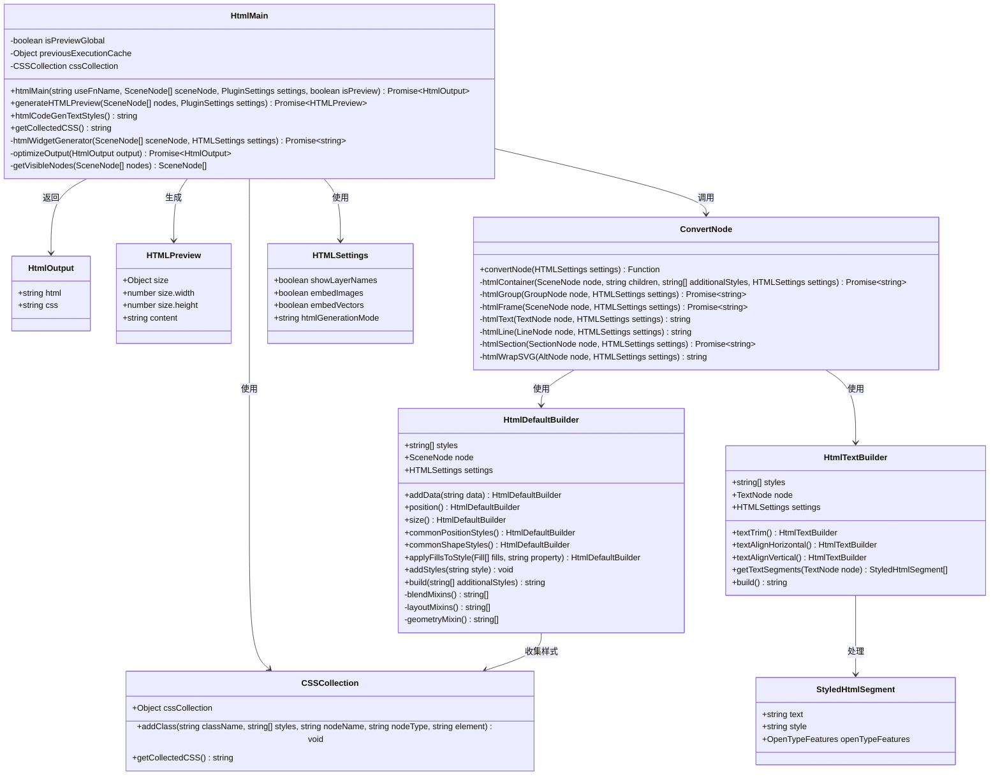
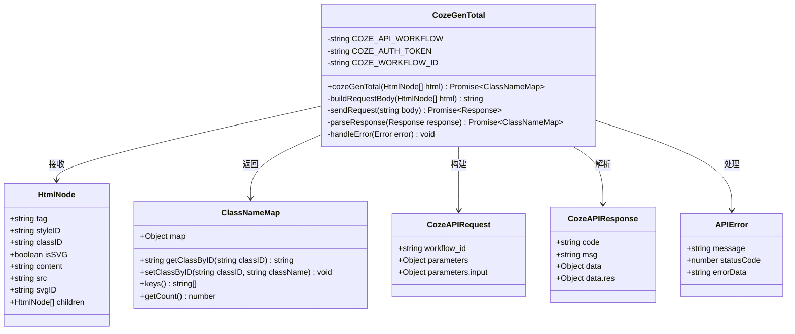
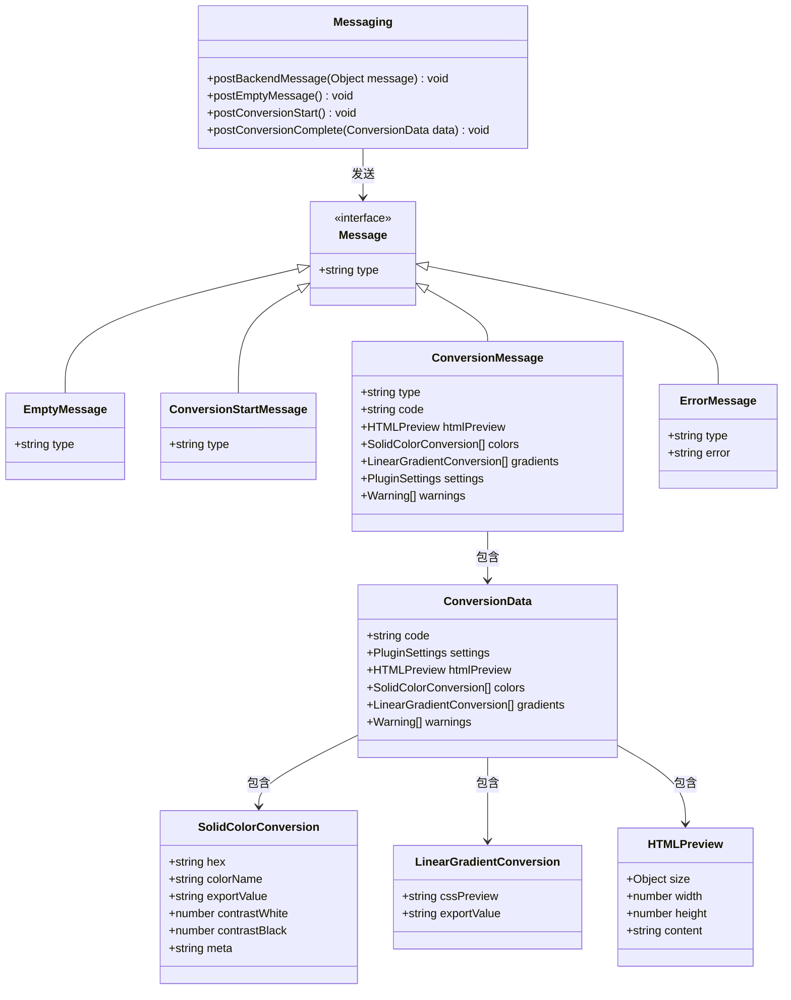
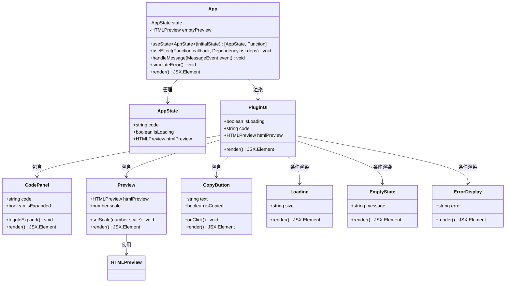
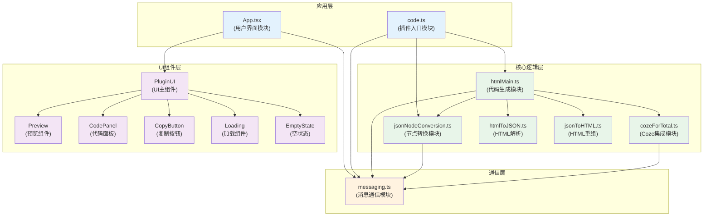

# 插件入口模块
## 模块类图代码

```mermaid
classDiagram
    class PluginEntry {
        -boolean isLoading
        -PluginSettings defaultSettings
        +standardMode() Promise~void~
        +codegenMode() Promise~void~
        +safeRun() Promise~void~
    }

    class PluginSettings {
        +Framework framework
        +boolean showLayerNames
        +boolean responsiveRoot
        +boolean embedImages
        +boolean embedVectors
        +string htmlGenerationMode
    }

    class FigmaAPI {
        +showUI(string html, ShowUIOptions options) void
        +on(string event, Function callback) void
        +off(string event, Function callback) void
        +loadAllPagesAsync() Promise~void~
        +get currentPage() PageNode
        +get mode() PluginMode
        +get ui() UIAPI
        +get codegen() CodegenAPI
    }

    class ShowUIOptions {
        +number width
        +number height
        +boolean themeColors
    }

    class SceneNode {
        +string id
        +string name
        +string type
        +number width
        +number height
        +boolean visible
        +SceneNode[] children
    }

    PluginEntry --> PluginSettings : 使用
    PluginEntry --> FigmaAPI : 调用
    PluginEntry --> SceneNode : 处理
    FigmaAPI --> ShowUIOptions : 参数

```

# 节点转换模块
## 模块类图代码

```mermaid
classDiagram
    class NodesToJSON {
        +nodesToJSON(SceneNode[] nodes) Promise~AltNode[]~
        -processNodePair(SceneNode node, AltNode altNode) AltNode
        -resetPerformanceCounters() void
        -getNodeByIdAsync(string id) Promise~SceneNode~
        -getStyledTextSegments(TextNode node) StyledTextSegment[]
        -processColorVariables(Fill[] fills) Promise~void~
    }

    class AltNode~T~ {
        +T originalNode
        +boolean canBeFlattened
        +string svg
        +string base64
        +string id
        +string name
        +string type
        +number width
        +number height
        +number x
        +number y
        +number rotation
        +boolean visible
        +Fill[] fills
        +Stroke[] strokes
        +Effect[] effects
        +SceneNode[] children
        +string parent
    }

    class PerformanceCounter {
        +number getNodeByIdAsyncTime
        +number getNodeByIdAsyncCalls
        +number getStyledTextSegmentsTime
        +number getStyledTextSegmentsCalls
        +number processColorVariablesTime
        +number processColorVariablesCalls
        +reset() void
    }

    class WarningCollector {
        +Warning[] warnings
        +addWarning(string warning) void
        +clearWarnings() void
        +getWarnings() Warning[]
    }

    class Warning {
        +string nodeType
        +string nodeName
        +string message
    }

    class StyledTextSegment {
        +string characters
        +FontName fontName
        +number fontSize
        +FontWeight fontWeight
        +number lineHeight
        +Color fillColor
        +OpenTypeFeatures openTypeFeatures
    }

    class Fill {
        +string type
        +Color color
        +number opacity
        +ImageRef imageRef
        +Vector2 scaleMode
    }

    NodesToJSON --> AltNode : 生成
    NodesToJSON --> PerformanceCounter : 使用
    NodesToJSON --> WarningCollector : 使用
    NodesToJSON --> StyledTextSegment : 处理
    AltNode --> Fill : 包含
    WarningCollector --> Warning : 收集

```

# 代码生成模块
## 模块类图代码

```mermaid
classDiagram
    class HtmlMain {
        -boolean isPreviewGlobal
        -Object previousExecutionCache
        -CSSCollection cssCollection
        +htmlMain(string useFnName, SceneNode[] sceneNode, PluginSettings settings, boolean isPreview) Promise~HtmlOutput~
        +generateHTMLPreview(SceneNode[] nodes, PluginSettings settings) Promise~HTMLPreview~
        +htmlCodeGenTextStyles() string
        +getCollectedCSS() string
        -htmlWidgetGenerator(SceneNode[] sceneNode, HTMLSettings settings) Promise~string~
        -optimizeOutput(HtmlOutput output) Promise~HtmlOutput~
        -getVisibleNodes(SceneNode[] nodes) SceneNode[]
    }

    class HtmlOutput {
        +string html
        +string css
    }

    class HTMLPreview {
        +Object size
        +number size.width
        +number size.height
        +string content
    }

    class ConvertNode {
        +convertNode(HTMLSettings settings) Function
        -htmlContainer(SceneNode node, string children, string[] additionalStyles, HTMLSettings settings) Promise~string~
        -htmlGroup(GroupNode node, HTMLSettings settings) Promise~string~
        -htmlFrame(SceneNode node, HTMLSettings settings) Promise~string~
        -htmlText(TextNode node, HTMLSettings settings) string
        -htmlLine(LineNode node, HTMLSettings settings) string
        -htmlSection(SectionNode node, HTMLSettings settings) Promise~string~
        -htmlWrapSVG(AltNode node, HTMLSettings settings) string
    }

    class HtmlDefaultBuilder {
        +string[] styles
        +SceneNode node
        +HTMLSettings settings
        +addData(string data) HtmlDefaultBuilder
        +position() HtmlDefaultBuilder
        +size() HtmlDefaultBuilder
        +commonPositionStyles() HtmlDefaultBuilder
        +commonShapeStyles() HtmlDefaultBuilder
        +applyFillsToStyle(Fill[] fills, string property) HtmlDefaultBuilder
        +addStyles(string style) void
        +build(string[] additionalStyles) string
        -blendMixins() string[]
        -layoutMixins() string[]
        -geometryMixin() string[]
    }

    class HtmlTextBuilder {
        +string[] styles
        +TextNode node
        +HTMLSettings settings
        +textTrim() HtmlTextBuilder
        +textAlignHorizontal() HtmlTextBuilder
        +textAlignVertical() HtmlTextBuilder
        +getTextSegments(TextNode node) StyledHtmlSegment[]
        +build() string
    }

    class StyledHtmlSegment {
        +string text
        +string style
        +OpenTypeFeatures openTypeFeatures
    }

    class CSSCollection {
        +Object cssCollection
        +addClass(string className, string[] styles, string nodeName, string nodeType, string element) void
        +getCollectedCSS() string
    }

    class HTMLSettings {
        +boolean showLayerNames
        +boolean embedImages
        +boolean embedVectors
        +string htmlGenerationMode
    }

    HtmlMain --> HtmlOutput : 返回
    HtmlMain --> HTMLPreview : 生成
    HtmlMain --> ConvertNode : 调用
    HtmlMain --> CSSCollection : 使用
    HtmlMain --> HTMLSettings : 使用
    ConvertNode --> HtmlDefaultBuilder : 使用
    ConvertNode --> HtmlTextBuilder : 使用
    HtmlTextBuilder --> StyledHtmlSegment : 处理
    HtmlDefaultBuilder --> CSSCollection : 收集样式

```

# Coze 工作流集成模块
## 模块类图代码

```mermaid
classDiagram
    class CozeGenTotal {
        -string COZE_API_WORKFLOW
        -string COZE_AUTH_TOKEN
        -string COZE_WORKFLOW_ID
        +cozeGenTotal(HtmlNode[] html) Promise~ClassNameMap~
        -buildRequestBody(HtmlNode[] html) string
        -sendRequest(string body) Promise~Response~
        -parseResponse(Response response) Promise~ClassNameMap~
        -handleError(Error error) void
    }

    class HtmlNode {
        +string tag
        +string styleID
        +string classID
        +boolean isSVG
        +string content
        +string src
        +string svgID
        +HtmlNode[] children
    }

    class ClassNameMap {
        +Object map
        +string getClassByID(string classID) string
        +setClassByID(string classID, string className) void
        +keys() string[]
        +getCount() number
    }

    class CozeAPIRequest {
        +string workflow_id
        +Object parameters
        +Object parameters.input
    }

    class CozeAPIResponse {
        +string code
        +string msg
        +Object data
        +Object data.res
    }

    class APIError {
        +string message
        +number statusCode
        +string errorData
    }

    CozeGenTotal --> HtmlNode : 接收
    CozeGenTotal --> ClassNameMap : 返回
    CozeGenTotal --> CozeAPIRequest : 构建
    CozeGenTotal --> CozeAPIResponse : 解析
    CozeGenTotal --> APIError : 处理

```

# 消息通信模块
## 模块类图代码

```mermaid
classDiagram
    class Messaging {
        +postBackendMessage(Object message) void
        +postEmptyMessage() void
        +postConversionStart() void
        +postConversionComplete(ConversionData data) void
    }

    class Message {
        <<interface>>
        +string type
    }

    class EmptyMessage {
        +string type
    }

    class ConversionStartMessage {
        +string type
    }

    class ConversionMessage {
        +string type
        +string code
        +HTMLPreview htmlPreview
        +SolidColorConversion[] colors
        +LinearGradientConversion[] gradients
        +PluginSettings settings
        +Warning[] warnings
    }

    class ErrorMessage {
        +string type
        +string error
    }

    class ConversionData {
        +string code
        +PluginSettings settings
        +HTMLPreview htmlPreview
        +SolidColorConversion[] colors
        +LinearGradientConversion[] gradients
        +Warning[] warnings
    }

    class SolidColorConversion {
        +string hex
        +string colorName
        +string exportValue
        +number contrastWhite
        +number contrastBlack
        +string meta
    }

    class LinearGradientConversion {
        +string cssPreview
        +string exportValue
    }

    class HTMLPreview {
        +Object size
        +number width
        +number height
        +string content
    }

    Message <|-- EmptyMessage
    Message <|-- ConversionStartMessage
    Message <|-- ConversionMessage
    Message <|-- ErrorMessage
    Messaging --> Message : 发送
    ConversionMessage --> ConversionData : 包含
    ConversionData --> SolidColorConversion : 包含
    ConversionData --> LinearGradientConversion : 包含
    ConversionData --> HTMLPreview : 包含

```

# 用户界面模块
## 模块类图代码

```mermaid
classDiagram
    class App {
        -AppState state
        -HTMLPreview emptyPreview
        +useState~AppState~(initialState) [AppState, Function]
        +useEffect(Function callback, DependencyList deps) void
        +handleMessage(MessageEvent event) void
        +simulateError() void
        +render() JSX.Element
    }

    class AppState {
        +string code
        +boolean isLoading
        +HTMLPreview htmlPreview
    }

    class PluginUI {
        +boolean isLoading
        +string code
        +HTMLPreview htmlPreview
        +render() JSX.Element
    }

    class CodePanel {
        +string code
        +boolean isExpanded
        +toggleExpand() void
        +render() JSX.Element
    }

    class Preview {
        +HTMLPreview htmlPreview
        +number scale
        +setScale(number scale) void
        +render() JSX.Element
    }

    class CopyButton {
        +string text
        +boolean isCopied
        +onClick() void
        +render() JSX.Element
    }

    class Loading {
        +string size
        +render() JSX.Element
    }

    class EmptyState {
        +string message
        +render() JSX.Element
    }

    class ErrorDisplay {
        +string error
        +render() JSX.Element
    }

    App --> AppState : 管理
    App --> PluginUI : 渲染
    PluginUI --> CodePanel : 包含
    PluginUI --> Preview : 包含
    PluginUI --> CopyButton : 包含
    PluginUI --> Loading : 条件渲染
    PluginUI --> EmptyState : 条件渲染
    PluginUI --> ErrorDisplay : 条件渲染
    Preview --> HTMLPreview : 使用

```

# 模块依赖关系总览

```mermaid
graph TD
    subgraph 应用层
        App["App.tsx<br/>(用户界面模块)"]
        Code["code.ts<br/>(插件入口模块)"]
    end

    subgraph 核心逻辑层
        HtmlMain["htmlMain.ts<br/>(代码生成模块)"]
        NodeConv["jsonNodeConversion.ts<br/>(节点转换模块)"]
        Coze["cozeForTotal.ts<br/>(Coze集成模块)"]
        HtmlToJSON["htmlToJSON.ts<br/>(HTML解析)"]
        JSONToHtml["jsonToHTML.ts<br/>(HTML重组)"]
    end

    subgraph 通信层
        Msg["messaging.ts<br/>(消息通信模块)"]
    end

    subgraph UI组件层
        PluginUI["PluginUI<br/>(UI主组件)"]
        Preview["Preview<br/>(预览组件)"]
        CodePanel["CodePanel<br/>(代码面板)"]
        CopyButton["CopyButton<br/>(复制按钮)"]
        Loading["Loading<br/>(加载组件)"]
        EmptyState["EmptyState<br/>(空状态)"]
    end

    App --> PluginUI
    App --> Msg
    Code --> HtmlMain
    Code --> NodeConv
    Code --> Msg
    HtmlMain --> NodeConv
    HtmlMain --> Coze
    HtmlMain --> Msg
    HtmlMain --> HtmlToJSON
    HtmlMain --> JSONToHtml
    NodeConv --> Msg
    Coze --> Msg
    PluginUI --> Preview
    PluginUI --> CodePanel
    PluginUI --> CopyButton
    PluginUI --> Loading
    PluginUI --> EmptyState

    style App fill:#e3f2fd
    style Code fill:#e3f2fd
    style HtmlMain fill:#e8f5e9
    style NodeConv fill:#e8f5e9
    style Coze fill:#e8f5e9
    style HtmlToJSON fill:#e8f5e9
    style JSONToHtml fill:#e8f5e9
    style Msg fill:#fff3e0
    style PluginUI fill:#f3e5f5
    style Preview fill:#f3e5f5
    style CodePanel fill:#f3e5f5
    style CopyButton fill:#f3e5f5
    style Loading fill:#f3e5f5
    style EmptyState fill:#f3e5f5
```
