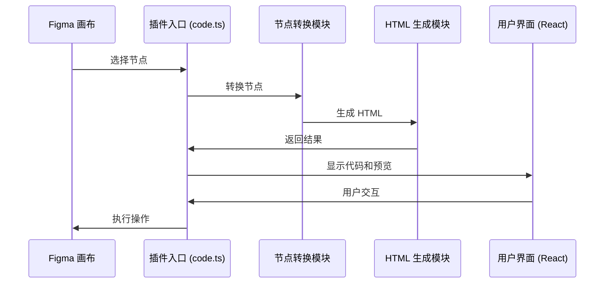

# Figma to HTML 插件实现文档

## 1. 项目概述

Figma to HTML 是一款基于 Figma 平台的插件，用于将 Figma 设计稿转换为高质量的 HTML 代码。本项目采用 Monorepo 结构，使用 TypeScript 开发，结合 React 和 Tailwind CSS 构建用户界面。

## 2. 项目架构与模块划分

项目采用分层架构设计，主要包含以下核心模块：

| 模块 | 职责 | 技术栈 | 文件位置 |
|------|------|--------|----------|
| 插件入口 | 插件初始化与生命周期管理 | TypeScript, Figma API | `apps/plugin/plugin-src/code.ts` |
| 节点转换 | Figma 节点到自定义 AltNode 的转换 | TypeScript | `packages/plugin-logic/src/altNodes/` |
| HTML 生成 | AltNode 到 HTML 代码的转换 | TypeScript | `packages/plugin-logic/src/html/` |
| 消息通信 | 沙箱与 UI 之间的通信 | TypeScript | `packages/plugin-logic/src/messaging.ts` |
| 用户界面 | 插件的 UI 组件与交互 | React, TypeScript, Tailwind CSS | `apps/plugin/ui-src/` |
| 类型定义 | 全局类型定义 | TypeScript | `packages/types/src/types.ts` |

## 3. 模块详细实现分析

### 3.1 插件入口模块

**职责**：负责插件的初始化、生命周期管理、事件监听和消息路由，是插件与 Figma 平台交互的核心入口点。

**核心功能**：
1. **插件初始化**：加载插件 UI 界面，设置初始尺寸，并配置必要的全局状态变量。
2. **事件监听**：监听 Figma 平台的关键事件，包括用户选择变化（selectionchange）和文档内容变化（documentchange），确保插件能实时响应设计稿的修改。
3. **消息处理**：接收并处理来自 UI 层的消息请求，根据消息类型执行相应的处理逻辑。
4. **转换流程管理**：协调节点转换和 HTML 生成的完整流程，包括启动转换、管理加载状态、处理转换结果和错误情况。
5. **结果反馈**：将转换后的 HTML 代码、预览内容和其他元数据发送回 UI 层，供用户查看和使用。

**核心代码**：

```typescript
// apps/plugin/plugin-src/code.ts
import { run, pluginMessage, ConversionResult } from "@figma-to-code/plugin-logic";

// 使用固定默认设置
const defaultSettings = {
  framework: "HTML",
  showLayerNames: false,
  responsiveRoot: false,
  embedImages: true,
  embedVectors: true,
  htmlGenerationMode: "html",
};

// 插件初始化
figma.showUI(__html__, { width: 600, height: 800 });

// 加载动画控制
let isLoading = false;

// 发送转换结果到 UI
const sendResult = (result: ConversionResult) => {
  figma.ui.postMessage({
    type: "code",
    code: result.code,
    preview: result.preview,
    colors: result.colors,
    gradients: result.gradients,
    warnings: result.warnings,
  });
};

// 安全运行转换函数
const safeRun = async () => {
  if (!isLoading) {
    try {
      isLoading = true;
      figma.ui.postMessage({ type: "conversionStart" });
      await run(defaultSettings);
    } catch (e) {
      console.error(e);
      figma.ui.postMessage({ type: "error", message: "转换失败" });
    } finally {
      setTimeout(() => { isLoading = false; }, 1);
    }
  }
};

// 监听 Figma 事件
figma.on("selectionchange", safeRun);
figma.on("documentchange", safeRun);

// 监听 UI 消息
figma.ui.onmessage = (msg: pluginMessage) => {
  switch (msg.type) {
    case "get-selection-json":
      // 处理 JSON 导出请求
      break;
    default:
      break;
  }
};

// 立即执行一次转换
safeRun();
```

### 3.2 节点转换模块

**职责**：将 Figma 原生节点树转换为标准化的自定义 AltNode 结构，实现设计稿数据的规范化和结构化，为后续 HTML 生成提供统一的数据源。

**核心功能**：
1. **递归节点遍历**：使用深度优先算法递归遍历复杂的 Figma 节点树结构，确保所有嵌套层级的节点都能被正确处理。
2. **节点类型转换**：根据节点类型（FRAME、TEXT、RECTANGLE、ELLIPSE、VECTOR 等）路由到对应的处理函数，实现不同节点类型的专用转换逻辑。
3. **样式与属性处理**：提取节点的各种样式属性（填充、边框、阴影、圆角等）和布局属性（位置、尺寸、旋转角度、可见性等），并转换为标准化的格式。
4. **唯一节点命名**：生成全局唯一的节点名称，避免节点名称冲突，确保后续 HTML 生成时的 DOM 元素唯一性。
5. **节点树优化**：过滤不可见节点，优化节点树结构，提高后续处理效率。

**核心代码**：

```typescript
// packages/plugin-logic/src/altNodes/nodesToJSON.ts
import { AltNode } from "./altMixins";
import { processNodePair } from "./processNodePair";
import { FigmaNode } from "@figma-to-code/types";

export async function nodesToJSON(figmaNodes: readonly FigmaNode[]): Promise<AltNode[]> {
  // 重置节点名称计数器
  globalThis.nodeNameCounters = new Map();
  
  // 转换每个节点
  const promises = figmaNodes.map(async (node) => {
    const parent: AltNode = { type: "parent", children: [] } as any;
    const result = await processNodePair(node, parent);
    return result;
  });
  
  return await Promise.all(promises);
}

// packages/plugin-logic/src/altNodes/processNodePair.ts
export async function processNodePair(
  node: FigmaNode,
  parent: AltNode
): Promise<AltNode | null> {
  // 处理不同类型的节点
  switch (node.type) {
    case "FRAME":
    case "INSTANCE":
    case "COMPONENT":
      return processFrameNode(node, parent);
    case "TEXT":
      return processTextNode(node, parent);
    case "GROUP":
      return processGroupNode(node, parent);
    case "RECTANGLE":
    case "ELLIPSE":
      return processContainerNode(node, parent);
    case "VECTOR":
      return processVectorNode(node, parent);
    default:
      return null;
  }
}
```

### 3.3 HTML 生成模块

**职责**：将标准化的 AltNode 结构转换为高质量的 HTML 和 CSS 代码，是插件的核心转换引擎。

**核心功能**：
1. **AltNode 树遍历**：递归遍历优化后的 AltNode 树结构，为每个节点生成对应的 HTML 表示。
2. **标签映射**：根据节点类型和属性映射生成合适的 HTML 标签（如 div、span、p 等）。
3. **CSS 生成与管理**：收集并管理生成的 CSS 样式，支持类选择器和内联样式两种生成模式。
4. **媒体资源处理**：处理图片和 SVG 等媒体资源，支持嵌入模式和外部引用模式。
5. **响应式支持**：根据设计稿的布局信息生成响应式的 HTML 结构和 CSS 样式，确保在不同设备上的良好显示效果。
6. **结果整合**：将生成的 HTML 和 CSS 整合为最终的转换结果，包括完整的代码和预览内容。

**核心代码**：

```typescript
// packages/plugin-logic/src/html/htmlMain.ts
import { ConversionResult, PluginSettings } from "@figma-to-code/types";
import { htmlWidgetGenerator } from "./htmlWidgetGenerator";
import { AltNode } from "../altNodes/altMixins";

export async function htmlMain(
  node: AltNode,
  settings: PluginSettings
): Promise<ConversionResult> {
  // 初始化全局 CSS 集合
  globalThis.cssCollection = new Map();
  
  // 生成 HTML
  const htmlCode = await htmlWidgetGenerator(node);
  
  // 收集 CSS
  const cssCode = Array.from(globalThis.cssCollection.values())
    .map((cssClass) => cssClass.buildCSS())
    .join("\n");
  
  // 构建最终结果
  return {
    code: `<div>${htmlCode}</div><style>${cssCode}</style>`,
    preview: htmlCode,
    colors: [], // 颜色处理结果
    gradients: [], // 渐变处理结果
    warnings: [], // 警告信息
  };
}

// packages/plugin-logic/src/html/htmlWidgetGenerator.ts
export async function htmlWidgetGenerator(
  node: AltNode
): Promise<string> {
  // 过滤不可见节点
  if (!node.visible) {
    return "";
  }
  
  // 并行处理所有子节点
  const childrenPromises = node.children
    ? node.children.map((child) => htmlWidgetGenerator(child))
    : [];
  
  const childrenHTML = await Promise.all(childrenPromises);
  
  // 转换当前节点
  const nodeHTML = await convertNode(node);
  
  return `${nodeHTML}${childrenHTML.join("")}`;
}
```

### 3.4 消息通信模块

**职责**：定义并管理插件沙箱（Figma 内部环境）与 UI 层（iframe 外部环境）之间的消息通信协议，确保两者之间安全、高效的数据交换。

**核心功能**：
1. **消息类型定义**：使用 TypeScript 接口定义完整的消息类型体系，包括转换开始、转换结果、错误信息等。
2. **消息序列化**：处理消息的序列化和反序列化，确保跨环境通信的数据一致性。
3. **类型安全保障**：通过严格的类型定义确保消息通信的类型安全，减少运行时错误。
4. **通信通道管理**：封装消息发送和接收的底层实现，提供简洁的 API 供上层模块使用。
5. **消息路由**：根据消息类型将接收到的消息路由到对应的处理函数，实现消息的分发和处理。

**核心代码**：

```typescript
// packages/plugin-logic/src/messaging.ts
import { ConversionResult, PluginSettings } from "@figma-to-code/types";

export type pluginMessage = 
  | {
      type: "conversionStart";
    }
  | {
      type: "code";
      code: string;
      preview: string;
      colors: SolidColorConversion[];
      gradients: LinearGradientConversion[];
      warnings: Warning[];
    }
  | {
      type: "empty";
    }
  | {
      type: "error";
      message: string;
    };

// UI 到沙箱的消息
export type uiMessage = 
  | {
      type: "get-selection-json";
    };
```

### 3.5 用户界面模块

**职责**：基于 React 框架构建直观、易用的插件用户界面，展示转换结果，提供交互功能，提升用户体验。

**核心功能**：
1. **实时预览**：提供 HTML 转换结果的实时预览功能，让用户直观地查看转换效果。
2. **代码展示**：展示生成的 HTML 和 CSS 代码，支持代码高亮和格式化，便于用户查看和编辑。
3. **交互功能**：提供代码复制、导出等实用功能，方便用户使用转换结果。
4. **状态管理**：管理和展示插件的各种状态（如加载中、转换完成、错误等），提供清晰的视觉反馈。
5. **响应式布局**：采用响应式设计，确保 UI 在不同尺寸的插件窗口中都能良好显示。
6. **消息处理**：接收并处理来自沙箱的消息，更新界面状态和展示内容。

**核心代码**：

```typescript
// apps/plugin/ui-src/App.tsx
import React, { useState, useEffect } from "react";
import { PluginUI } from "@figma-to-code/plugin-ui";
import { ConversionResult, pluginMessage } from "@figma-to-code/plugin-logic";
import { sendMessage } from "./messaging";

function App() {
  const [code, setCode] = useState<string>("");
  const [isLoading, setIsLoading] = useState<boolean>(false);
  const [htmlPreview, setHtmlPreview] = useState<{ size: { width: number; height: number }; content: string }>({ size: { width: 0, height: 0 }, content: "" });
  const [colors, setColors] = useState<any[]>([]);
  const [gradients, setGradients] = useState<any[]>([]);

  // 处理从沙箱接收到的消息
  useEffect(() => {
    const handleMessage = (event: MessageEvent) => {
      const msg: pluginMessage = event.data;
      
      switch (msg.type) {
        case "conversionStart":
          setIsLoading(true);
          break;
        case "code":
          setCode(msg.code);
          setHtmlPreview({ size: { width: 800, height: 600 }, content: msg.preview });
          setColors(msg.colors || []);
          setGradients(msg.gradients || []);
          setIsLoading(false);
          break;
        case "empty":
          setCode("");
          setHtmlPreview({ size: { width: 800, height: 600 }, content: "<div style='display: flex; align-items: center; justify-content: center; height: 100%; color: #888;'>请在 Figma 中选择一个节点</div>" });
          setIsLoading(false);
          break;
        case "error":
          setCode(`<div style='color: red;'>转换失败: ${msg.message}</div>`);
          setIsLoading(false);
          break;
        default:
          break;
      }
    };

    window.addEventListener("message", handleMessage);
    return () => window.removeEventListener("message", handleMessage);
  }, []);

  return (
    <div className="bg-background h-full flex flex-col">
      <PluginUI
        code={code}
        htmlPreview={htmlPreview}
        isLoading={isLoading}
        colors={colors}
        gradients={gradients}
      />
    </div>
  );
}

export default App;
```

### 3.6 类型定义模块

**职责**：定义项目的全局类型系统，确保各模块之间的数据交换类型安全，提高代码的可维护性和可靠性。

**核心功能**：
1. **节点类型定义**：定义 Figma 原生节点和自定义 AltNode 的类型结构，确保节点数据的类型安全。
2. **转换结果类型**：定义转换结果的结构，包括生成的代码、预览内容、颜色集合、渐变集合和警告信息等。
3. **插件设置类型**：定义插件的配置选项类型，包括框架选择、代码生成模式、资源嵌入策略等。
4. **消息类型定义**：定义沙箱与 UI 之间通信的消息类型，确保跨模块通信的类型安全。
5. **工具类型**：提供各种辅助类型和工具函数，支持类型推导和类型转换，增强 TypeScript 的类型系统能力。

**核心代码**：

```typescript
// packages/types/src/types.ts
export interface PluginSettings {
  framework: string;
  showLayerNames: boolean;
  responsiveRoot: boolean;
  embedImages: boolean;
  embedVectors: boolean;
  htmlGenerationMode: string;
}

export interface ConversionResult {
  code: string;
  preview: string;
  colors: SolidColorConversion[];
  gradients: LinearGradientConversion[];
  warnings: Warning[];
}

export interface SolidColorConversion {
  name: string;
  color: string;
}

export interface LinearGradientConversion {
  name: string;
  gradient: string;
}

export interface Warning {
  message: string;
  nodeId: string;
  severity: "low" | "medium" | "high";
}

export interface AltNode {
  id: string;
  name: string;
  uniqueName: string;
  type: string;
  parent: AltNode | null;
  children: AltNode[] | null;
  x: number;
  y: number;
  width: number;
  height: number;
  visible: boolean;
  rotation: number;
  cumulativeRotation: number;
}
```

## 4. 模块交互关系

各模块之间的交互关系如下：



## 5. 关键技术亮点

1. **并行处理**：
   - 使用 Promise.all 并行处理节点转换和 HTML 生成
   - 提高大型设计稿的转换效率

2. **递归节点处理**：
   - 采用递归算法遍历复杂的节点树结构
   - 支持嵌套和复杂布局

3. **模块化设计**：
   - 各模块职责清晰，便于维护和扩展
   - 使用 TypeScript 确保类型安全

4. **实时预览**：
   - 转换结果即时反馈
   - 提高用户体验

5. **Monorepo 管理**：
   - 使用 Turborepo 管理多包项目
   - 共享类型和工具函数

## 6. 总结

Figma to HTML 插件采用了模块化、分层架构设计，各模块职责清晰，交互流畅。核心功能包括节点转换、HTML 生成和用户界面展示。插件使用 TypeScript 确保类型安全，采用并行处理提高性能，并通过实时预览提升用户体验。项目的 Monorepo 结构便于代码管理和维护，为后续功能扩展提供了良好的基础。