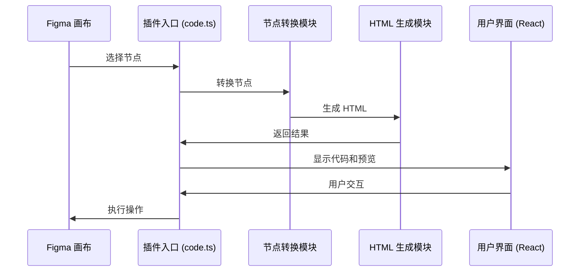

# Figma to HTML 插件实现文档

## 1. 项目概述

Figma to HTML 是一款基于 Figma 平台的插件，用于将 Figma 设计稿转换为高质量的 HTML 代码。本项目采用 Monorepo 结构，使用 TypeScript 开发，结合 React 和 Tailwind CSS 构建用户界面。

## 2. 项目架构与模块划分

项目采用分层架构设计，主要包含以下核心模块：

| 模块 | 职责 | 技术栈 | 文件位置 |
|------|------|--------|----------|
| 插件入口 | 插件初始化与生命周期管理 | TypeScript, Figma API | `apps/plugin/plugin-src/code.ts` |
| 节点转换 | Figma 节点到自定义 AltNode 的转换 | TypeScript | `packages/plugin-logic/src/altNodes/` |
| HTML 生成 | AltNode 到 HTML 代码的转换 | TypeScript | `packages/plugin-logic/src/html/` |
| 消息通信 | 沙箱与 UI 之间的通信 | TypeScript | `packages/plugin-logic/src/messaging.ts` |
| 用户界面 | 插件的 UI 组件与交互 | React, TypeScript, Tailwind CSS | `apps/plugin/ui-src/` |
| 类型定义 | 全局类型定义 | TypeScript | `packages/types/src/types.ts` |

## 3. 模块详细实现分析

### 3.1 插件入口模块

**职责**：负责插件的初始化、生命周期管理、事件监听和消息路由，是插件与 Figma 平台交互的核心入口点。

**核心功能**：
1. **插件初始化**：加载插件 UI 界面，设置初始尺寸，并配置必要的全局状态变量。
2. **事件监听**：监听 Figma 平台的关键事件，包括用户选择变化（selectionchange）和文档内容变化（documentchange），确保插件能实时响应设计稿的修改。
3. **消息处理**：接收并处理来自 UI 层的消息请求，根据消息类型执行相应的处理逻辑。
4. **转换流程管理**：协调节点转换和 HTML 生成的完整流程，包括启动转换、管理加载状态、处理转换结果和错误情况。
5. **结果反馈**：将转换后的 HTML 代码、预览内容和其他元数据发送回 UI 层，供用户查看和使用。

**核心代码**：

```typescript
// apps/plugin/plugin-src/code.ts
import { run, pluginMessage, ConversionResult } from "@figma-to-code/plugin-logic";

// 使用固定默认设置
const defaultSettings = {
  framework: "HTML",
  showLayerNames: false,
  responsiveRoot: false,
  embedImages: true,
  embedVectors: true,
  htmlGenerationMode: "html",
};

// 插件初始化
figma.showUI(__html__, { width: 600, height: 800 });

// 加载动画控制
let isLoading = false;

// 发送转换结果到 UI
const sendResult = (result: ConversionResult) => {
  figma.ui.postMessage({
    type: "code",
    code: result.code,
    preview: result.preview,
    colors: result.colors,
    gradients: result.gradients,
    warnings: result.warnings,
  });
};

// 安全运行转换函数
const safeRun = async () => {
  if (!isLoading) {
    try {
      isLoading = true;
      figma.ui.postMessage({ type: "conversionStart" });
      await run(defaultSettings);
    } catch (e) {
      console.error(e);
      figma.ui.postMessage({ type: "error", message: "转换失败" });
    } finally {
      setTimeout(() => { isLoading = false; }, 1);
    }
  }
};

// 监听 Figma 事件
figma.on("selectionchange", safeRun);
figma.on("documentchange", safeRun);

// 监听 UI 消息
figma.ui.onmessage = (msg: pluginMessage) => {
  switch (msg.type) {
    case "get-selection-json":
      // 处理 JSON 导出请求
      break;
    default:
      break;
  }
};

// 立即执行一次转换
safeRun();
```

### 3.2 节点转换模块

**职责**：将 Figma 原生节点树转换为标准化的自定义 AltNode 结构，实现设计稿数据的规范化和结构化，为后续 HTML 生成提供统一的数据源。

**核心功能**：
1. **递归节点遍历**：使用深度优先算法递归遍历复杂的 Figma 节点树结构，确保所有嵌套层级的节点都能被正确处理。
2. **节点类型转换**：根据节点类型（FRAME、TEXT、RECTANGLE、ELLIPSE、VECTOR 等）路由到对应的处理函数，实现不同节点类型的专用转换逻辑。
3. **样式与属性处理**：提取节点的各种样式属性（填充、边框、阴影、圆角等）和布局属性（位置、尺寸、旋转角度、可见性等），并转换为标准化的格式。
4. **唯一节点命名**：生成全局唯一的节点名称，避免节点名称冲突，确保后续 HTML 生成时的 DOM 元素唯一性。
5. **节点树优化**：过滤不可见节点，优化节点树结构，提高后续处理效率。

**核心代码**：

```typescript
// packages/plugin-logic/src/altNodes/nodesToJSON.ts
import { AltNode } from "./altMixins";
import { processNodePair } from "./processNodePair";
import { FigmaNode } from "@figma-to-code/types";

export async function nodesToJSON(figmaNodes: readonly FigmaNode[]): Promise<AltNode[]> {
  // 重置节点名称计数器
  globalThis.nodeNameCounters = new Map();
  
  // 转换每个节点
  const promises = figmaNodes.map(async (node) => {
    const parent: AltNode = { type: "parent", children: [] } as any;
    const result = await processNodePair(node, parent);
    return result;
  });
  
  return await Promise.all(promises);
}

// packages/plugin-logic/src/altNodes/processNodePair.ts
export async function processNodePair(
  node: FigmaNode,
  parent: AltNode
): Promise<AltNode | null> {
  // 处理不同类型的节点
  switch (node.type) {
    case "FRAME":
    case "INSTANCE":
    case "COMPONENT":
      return processFrameNode(node, parent);
    case "TEXT":
      return processTextNode(node, parent);
    case "GROUP":
      return processGroupNode(node, parent);
    case "RECTANGLE":
    case "ELLIPSE":
      return processContainerNode(node, parent);
    case "VECTOR":
      return processVectorNode(node, parent);
    default:
      return null;
  }
}
```

### 3.3 HTML 生成模块

**职责**：将标准化的 AltNode 结构转换为高质量的 HTML 和 CSS 代码，并结合 Coze 工作流进行 AI 智能优化，是插件的核心转换引擎。

**核心功能**：
1. **AltNode 树遍历**：递归遍历优化后的 AltNode 树结构，为每个节点生成对应的 HTML 表示。
2. **标签映射**：根据节点类型和属性映射生成合适的 HTML 标签（如 div、span、p 等）。
3. **CSS 生成与管理**：收集并管理生成的 CSS 样式，支持类选择器和内联样式两种生成模式。
4. **媒体资源处理**：处理图片和 SVG 等媒体资源，支持嵌入模式和外部引用模式。
5. **响应式支持**：根据设计稿的布局信息生成响应式的 HTML 结构和 CSS 样式，确保在不同设备上的良好显示效果。
6. **AI 智能优化**：集成 Coze 工作流，通过 AI 优化类名映射和代码结构，提升生成代码的质量和可维护性。
7. **结果整合**：将生成的 HTML 和 CSS 整合为最终的转换结果，包括完整的代码和预览内容。

**核心代码**：

```typescript
// packages/plugin-logic/src/html/htmlMain.ts
import { indentString } from "../common/utils/indentString";
import { HtmlTextBuilder } from "./htmlTextBuilder";
import { HtmlDefaultBuilder } from "./htmlDefaultBuilder";
import { htmlAutoLayoutProps } from "./builderImpl/htmlAutoLayout";
import { format } from "../common/utils/formatTool";
import {
  AltNode,
  ExportableNode,
  HTMLPreview,
  HTMLSettings,
  PluginSettings,
} from "types";
import { renderAndAttachSVG } from "../altNodes/altNodeUtils";
import {
  exportNodeAsBase64PNG,
  getPlaceholderImage,
  nodeHasImageFill,
} from "../common/commonImage";
import { addWarning } from "../common/commonWarning";
import {
  parseHTMLToNodes
} from "./tools/htmlToJSON";
import {
  parseNodesToHTML
} from "./tools/jsonToHTML";
import { cozeGenTotal } from "./tools/cozeForTotal";

// 全局预览标志
export let isPreviewGlobal = false;

// 用于缓存上一次执行的样式和文本
let previousExecutionCache: { style: string; text: string }[];

/**
 * HTML输出接口定义
 */
export interface HtmlOutput {
  html: string; // HTML内容
  css?: string; // 可选的CSS样式
}

/**
 * CSS集合类型定义
 */
interface CSSCollection {
  [className: string]: {
    styles: string[]; // 样式规则数组
    nodeName?: string; // 节点名称
    nodeType?: string; // 节点类型
    element?: string; // 基础HTML元素
  };
}

// 全局CSS集合
export let cssCollection: CSSCollection = {};

/**
 * 获取收集的CSS样式字符串
 * @returns 格式化后的CSS字符串
 */
export function getCollectedCSS(): string {
  if (Object.keys(cssCollection).length === 0) {
    return "";
  }

  return Object.entries(cssCollection)
    .map(([className, { styles }]) => {
      if (!styles.length) return "";
      return `.${className} {\n  ${styles.join(";\n  ")}${styles.length ? ";" : ""}\n}`;
    })
    .filter(Boolean)
    .join("\n\n");
}

/**
 * 主HTML生成函数
 * @param useFnName 调用者的名字
 * @param sceneNode 场景节点数组
 * @param settings 插件设置
 * @param isPreview 是否为预览模式
 * @returns 包含HTML和CSS的输出对象
 */
export const htmlMain = async (
  useFnName: string,
  sceneNode: any[],
  settings: PluginSettings,
  isPreview: boolean = false,
): Promise<HtmlOutput> => {
  console.log(useFnName, "调用了htmlMain");
  isPreviewGlobal = isPreview;
  previousExecutionCache = [];
  cssCollection = {};

  // 生成HTML内容
  let htmlContent = await htmlWidgetGenerator(sceneNode, settings);

  // 去除开头的换行符
  if (htmlContent.length > 0 && htmlContent.startsWith("\n")) {
    htmlContent = htmlContent.slice(1, htmlContent.length);
  }

  const output: HtmlOutput = { html: htmlContent };

  // 如果有收集的CSS样式，添加到输出
  if (Object.keys(cssCollection).length > 0) {
    output.css = getCollectedCSS();
  }

  // 生成预览时，直接返回输出对象，避免重复调用大模型
  if (useFnName === "generateHTMLPreview") {
    return output;
  } else if (useFnName === "convertToCode") {
    return await optimizeOutput(output);
  }
  return output;
};

/**
 * AI优化输出函数
 * 使用Coze工作流对生成的HTML进行智能优化
 * @param output 原始HTML输出
 * @returns 优化后的HTML输出
 */
const optimizeOutput = async (output: HtmlOutput): Promise<HtmlOutput> => {
  let jsonNodes; // 解析后的节点数据
  let svgMap; // 矢量图形内容映射
  let styleContentMap; // 样式内容映射
  let classMap; // 类名映射
  let AIclassNameMap; // AI处理后的类名映射

  // 解析HTML为节点结构
  const { nodes, svgContentMap, styleMap, classNameMap } = parseHTMLToNodes(output.html);
  jsonNodes = nodes;
  svgMap = svgContentMap;
  styleContentMap = styleMap;
  classMap = classNameMap; // 默认使用人工类名
  console.log("[调试] parseHTMLToNodes解析完成的节点数据:", jsonNodes);

  try {
    AIclassNameMap = await cozeGenTotal(jsonNodes);
    // TODO: 回退工作流
    console.log("[调试] AI处理后的结果:", AIclassNameMap);

    // 检查AI处理结果与人工生成结果的数量是否一致
    const aiCount = Object.keys(AIclassNameMap).length;
    const manualCount = Object.keys(classNameMap).length;
    console.log(`[调试] AI键数量: ${aiCount} vs 人工键数量: ${manualCount}`);

    // 如果结构一致且数量一致，使用AI生成的类名；否则使用人工类名
    if (aiCount === manualCount) {
      classMap = AIclassNameMap;
    } else {
      console.log("[警告] JSON结构不一致或数量不匹配，使用人工类名");
    }
  } catch (error: any) {
    console.error("[错误] 节点处理出错:", error);
  } finally {
    // 最终将处理后的节点转换为HTML
    output.html = parseNodesToHTML(
      jsonNodes,
      svgMap,
      styleContentMap,
      classMap,
    );
  }

  return output;
};

/**
 * 生成HTML预览
 * @param nodes 场景节点数组
 * @param settings 插件设置
 * @returns HTML预览对象
 */
export const generateHTMLPreview = async (
  nodes: SceneNode[],
  settings: PluginSettings,
): Promise<HTMLPreview> => {
  let result = await htmlMain(
    "generateHTMLPreview",
    nodes,
    {
      ...settings,
      htmlGenerationMode: "html",
    },
    nodes.length <= 1,
  );

  // 多个节点时添加外层div
  if (nodes.length > 1) {
    result.html = `<div style="width: 100%; height: 100%">${result.html}</div>`;
  }

  return {
    size: {
      width: Math.max(...nodes.map((node) => node.width)),
      height: nodes.reduce((sum, node) => sum + node.height, 0),
    },
    content: result.html,
  };
};

/**
 * 获取可见节点
 * @param nodes 节点数组
 * @returns 可见节点数组
 */
const getVisibleNodes = (nodes: readonly SceneNode[]) =>
  nodes.filter((d) => d.visible ?? true);

/**
 * HTML组件生成器
 * @param sceneNode 场景节点数组
 * @param settings HTML设置
 * @returns 生成的HTML字符串
 */
const htmlWidgetGenerator = async (
  sceneNode: ReadonlyArray<SceneNode>,
  settings: HTMLSettings,
): Promise<string> => {
  // 过滤不可见节点并转换每个节点
  const promiseOfConvertedCode = getVisibleNodes(sceneNode).map(
    convertNode(settings),
  );
  return (await Promise.all(promiseOfConvertedCode)).join("");
};

/**
 * 节点转换函数
 * @param settings HTML设置
 * @returns 返回转换节点的函数
 */
const convertNode = (settings: HTMLSettings) => async (node: SceneNode) => {
  // 处理矢量图形
  if (settings.embedVectors && (node as any).canBeFlattened) {
    const altNode = await renderAndAttachSVG(node);
    if (altNode.svg) {
      return htmlWrapSVG(altNode, settings);
    }
  }

  // 根据节点类型调用不同的转换方法
  switch (node.type) {
    case "RECTANGLE":
    case "ELLIPSE":
      return await htmlContainer(node, "", [], settings);
    case "GROUP":
      return await htmlGroup(node, settings);
    case "FRAME":
    case "COMPONENT":
    case "INSTANCE":
    case "COMPONENT_SET":
      return await htmlFrame(node, settings);
    case "SECTION":
      return await htmlSection(node, settings);
    case "TEXT":
      return htmlText(node, settings);
    case "LINE":
      return htmlLine(node, settings);
    case "VECTOR":
      if (!settings.embedVectors && !isPreviewGlobal) {
        addWarning("矢量图形不支持");
      }
      return await htmlContainer(
        { ...node, type: "RECTANGLE" } as any,
        "",
        [],
        settings,
      );
    default:
      addWarning(`${node.type} 类型节点不支持`);
      return "";
  }
};

/**
 * 包装SVG内容
 * @param node 节点
 * @param settings HTML设置
 * @returns 包装后的SVG HTML字符串
 */
const htmlWrapSVG = (
  node: AltNode<SceneNode>,
  settings: HTMLSettings,
): string => {
  if (node.svg === "") return "";

  const builder = new HtmlDefaultBuilder(node, settings)
    .addData("svg-wrapper")
    .position();

  return `\n<div${builder.build()}>\n${indentString(node.svg ?? "")}</div>`;
};

/**
 * 处理组节点
 * @param node 组节点
 * @param settings HTML设置
 * @returns 生成的HTML字符串
 */
const htmlGroup = async (
  node: GroupNode,
  settings: HTMLSettings,
): Promise<string> => {
  // 忽略无效尺寸的节点
  if (node.width < 0 || node.height <= 0 || node.children.length === 0) {
    return "";
  }

  const builder = new HtmlDefaultBuilder(node, settings).commonPositionStyles();

  if (builder.styles) {
    const attr = builder.build();
    const generator = await htmlWidgetGenerator(node.children, settings);
    return `\n<div${attr}>${indentString(generator)}\n</div>`;
  }
  return await htmlWidgetGenerator(node.children, settings);
};

/**
 * 处理文本节点
 * @param node 文本节点
 * @param settings HTML设置
 * @returns 生成的HTML字符串
 */
const htmlText = (node: TextNode, settings: HTMLSettings): string => {
  let layoutBuilder = new HtmlTextBuilder(node, settings)
    .commonPositionStyles()
    .textTrim()
    .textAlignHorizontal()
    .textAlignVertical();

  const styledHtml = layoutBuilder.getTextSegments(node);
  previousExecutionCache.push(...styledHtml);

  // 处理单个文本段
  let content: string;
  if (styledHtml.length === 1) {
    layoutBuilder.addStyles(styledHtml[0].style);
    content = styledHtml[0].text;

    // 处理上下标
    const additionalTag = styledHtml[0].openTypeFeatures.SUBS
      ? "sub"
      : styledHtml[0].openTypeFeatures.SUPS
        ? "sup"
        : "";

    if (additionalTag) {
      content = `<${additionalTag}>${content}</${additionalTag}>`;
    }
  } else {
    // 处理多文本段
    content = styledHtml
      .map((style) => {
        const tag = style.openTypeFeatures.SUBS
          ? "sub"
          : style.openTypeFeatures.SUPS
            ? "sup"
            : "span";

        return `<${tag} style="${style.style}">${style.text}</${tag}>`;
      })
      .join("");
  }

  // 替换连续空格为HTML实体
  return `\n<span${layoutBuilder.build()}>${content.replace(/\s\s/g, "&nbsp;&nbsp;")}</span>`;
};

/**
 * 处理框架节点
 * @param node 框架节点
 * @param settings HTML设置
 * @returns 生成的HTML字符串
 */
const htmlFrame = async (
  node: SceneNode & BaseFrameMixin,
  settings: HTMLSettings,
): Promise<string> => {
  const childrenStr = await htmlWidgetGenerator(node.children, settings);

  if (node.layoutMode !== "NONE") {
    const rowColumn = htmlAutoLayoutProps(node);
    return await htmlContainer(node, childrenStr, rowColumn, settings);
  }

  return await htmlContainer(node, childrenStr, [], settings);
};

/**
 * 处理容器节点
 * @param node 节点
 * @param children 子节点HTML
 * @param additionalStyles 附加样式
 * @param settings HTML设置
 * @returns 生成的HTML字符串
 */
const htmlContainer = async (
  node: SceneNode &
    SceneNodeMixin &
    BlendMixin &
    LayoutMixin &
    GeometryMixin &
    MinimalBlendMixin,
  children: string,
  additionalStyles: string[] = [],
  settings: HTMLSettings,
): Promise<string> => {
  // 忽略无效尺寸的节点
  if (node.width <= 0 || node.height <= 0) {
    return children;
  }

  const builder = new HtmlDefaultBuilder(node, settings)
    .commonPositionStyles()
    .commonShapeStyles();

  if (builder.styles || additionalStyles) {
    let tag = "div";
    let src = "";

    // 处理图片填充
    if (nodeHasImageFill(node)) {
      const altNode = node as AltNode<ExportableNode>;
      const hasChildren = "children" in node && node.children.length > 0;
      let imgUrl: string;

      if (
        settings.embedImages &&
        (settings as PluginSettings).framework === "HTML"
      ) {
        imgUrl = (await exportNodeAsBase64PNG(altNode, hasChildren)) ?? "";
      } else {
        imgUrl = getPlaceholderImage(node.width, node.height);
      }

      if (hasChildren) {
        builder.addStyles(format("background-image", `url(${imgUrl})`));
      } else {
        tag = "img";
        src = ` src="${imgUrl}"`;
      }
    }

    const build = builder.build(additionalStyles);

    if (children) {
      return `\n<${tag}${build}${src}>${indentString(children)}\n</${tag}>`;
    } else {
      return `\n<${tag}${build}${src}></${tag}>`;
    }
  }

  return children;
};

/**
 * 处理区域节点
 * @param node 区域节点
 * @param settings HTML设置
 * @returns 生成的HTML字符串
 */
const htmlSection = async (
  node: SectionNode,
  settings: HTMLSettings,
): Promise<string> => {
  const childrenStr = await htmlWidgetGenerator(node.children, settings);
  const builder = new HtmlDefaultBuilder(node, settings)
    .size()
    .position()
    .applyFillsToStyle(node.fills, "background");

  if (childrenStr) {
    return `\n<div${builder.build()}>${indentString(childrenStr)}\n</div>`;
  } else {
    return `\n<div${builder.build()}></div>`;
  }
};

/**
 * 处理线条节点
 * @param node 线条节点
 * @param settings HTML设置
 * @returns 生成的HTML字符串
 */
const htmlLine = (node: LineNode, settings: HTMLSettings): string => {
  const builder = new HtmlDefaultBuilder(node, settings)
    .commonPositionStyles()
    .commonShapeStyles();

  return `\n<div${builder.build()}></div>`;
};

/**
 * 生成文本样式代码
 * @returns 文本样式代码字符串
 */
export const htmlCodeGenTextStyles = () => {
  const result = previousExecutionCache
    .map((style) => `// ${style.text}\n${style.style.split(";").join(";\n")}`)
    .join("\n---\n");

  if (!result) {
    return "// 当前选择中没有文本样式";
  }
  return result;
};
```

### 3.4 Coze 工作流集成模块

**职责**：集成 Coze AI 工作流，对生成的 HTML 代码进行智能优化，提升代码质量和可维护性。

**核心功能**：
1. **工作流调用**：通过 Coze API 调用预配置的工作流，将 HTML 节点数据发送给 AI 进行处理。
2. **智能类名映射**：AI 根据节点结构和语义，生成更合理、更易维护的 CSS 类名。
3. **结果验证**：验证 AI 处理结果与原始数据的一致性，确保结构完整性。
4. **错误处理**：处理 AI 调用失败的情况，提供回退机制，确保系统稳定性。
5. **性能优化**：在预览模式下跳过 AI 调用，提高响应速度。

**核心代码**：

```typescript
// packages/plugin-logic/src/html/tools/cozeForTotal.ts
import { HtmlNode } from "../../node_types";

const COZE_API_WORKFLOW = 'https://api.coze.cn/v1/workflow/run'
const COZE_AUTH_TOKEN = 'pat_VfbV3r9a77ajA6cBDlqc0XUM6Tqzrh6GiHoOkL8DVX7UQKN1SPRRev3jtwvjgCub'
const COZE_WORKFLOW_ID = '7540216444618588206' // 工作流ID，可在Coze控制台查看

/**
 * 调用Coze工作流（仅传入file_id参数）
 * @returns Promise<any> 工作流返回结果
 * @param html
 */
export const cozeGenTotal = async (html: HtmlNode[]): Promise<any> => {
    try {
        const body = JSON.stringify({
            workflow_id: COZE_WORKFLOW_ID,
            parameters: {
                input: html,
            }
        });
        
        const response = await fetch(COZE_API_WORKFLOW, {
            method: 'POST',
            headers: {
                'Authorization': `Bearer ${COZE_AUTH_TOKEN}`,
                'Content-Type': 'application/json',
            },
            body: body
        });

        if (!response.ok) {
            const errorData = await response.json().catch(() => ({}));
            throw new Error(`工作流调用失败: ${errorData.message || `HTTP ${response.status}`}`);
        }

        const result = await response.json();
        console.log("Coze工作流调用成功，结果：", result);
        
        let parsedData;
        if (typeof result.data === 'string') {
            try {
                parsedData = JSON.parse(result.data); // 将字符串解析为对象
                console.log('data 字段是字符串，尝试解析', parsedData);
            } catch (parseError: any) {
                throw new Error(`data 解析失败: ${parseError.message}`);
            }
        } else {
            // 如果 data 不是字符串，直接使用（兼容可能的格式变化）
            parsedData = result.data;
            console.log('data 字段不是字符串，直接使用',  parsedData);
        }
        
        if (parsedData.res) {
            return parsedData.res;
        } else {
            throw new Error('解析后的数据中未找到 res 字段');
        }

    } catch (error) {
        console.error('Coze工作流调用失败:', error);
        throw error;
    }
};
```

**AI 优化流程**：

1. **HTML 解析**：将生成的 HTML 解析为结构化的节点数据（`parseHTMLToNodes`）
2. **AI 处理**：调用 Coze 工作流，AI 根据节点语义生成优化的类名映射
3. **结果验证**：比较 AI 结果和人工生成结果的数量和结构
4. **类名替换**：如果验证通过，使用 AI 生成的类名；否则使用人工类名
5. **HTML 重建**：使用优化后的类名映射重新生成 HTML 代码

**性能优化策略**：

- **预览模式优化**：在预览模式下（`useFnName === "generateHTMLPreview"`），跳过 AI 调用，直接返回原始结果，提高响应速度
- **错误回退**：当 AI 调用失败或结果不一致时，自动回退到人工生成的类名，确保系统稳定性
- **异步处理**：AI 调用采用异步方式，不阻塞主流程

### 3.5 消息通信模块

**职责**：定义并管理插件沙箱（Figma 内部环境）与 UI 层（iframe 外部环境）之间的消息通信协议，确保两者之间安全、高效的数据交换。

**核心功能**：
1. **消息类型定义**：使用 TypeScript 接口定义完整的消息类型体系，包括转换开始、转换结果、错误信息等。
2. **消息序列化**：处理消息的序列化和反序列化，确保跨环境通信的数据一致性。
3. **类型安全保障**：通过严格的类型定义确保消息通信的类型安全，减少运行时错误。
4. **通信通道管理**：封装消息发送和接收的底层实现，提供简洁的 API 供上层模块使用。
5. **消息路由**：根据消息类型将接收到的消息路由到对应的处理函数，实现消息的分发和处理。

**核心代码**：

```typescript
// packages/plugin-logic/src/messaging.ts
import { ConversionResult, PluginSettings } from "@figma-to-code/types";

export type pluginMessage = 
  | {
      type: "conversionStart";
    }
  | {
      type: "code";
      code: string;
      preview: string;
      colors: SolidColorConversion[];
      gradients: LinearGradientConversion[];
      warnings: Warning[];
    }
  | {
      type: "empty";
    }
  | {
      type: "error";
      message: string;
    };

// UI 到沙箱的消息
export type uiMessage = 
  | {
      type: "get-selection-json";
    };
```

### 3.5 用户界面模块

**职责**：基于 React 框架构建直观、易用的插件用户界面，展示转换结果，提供交互功能，提升用户体验。

**核心功能**：
1. **实时预览**：提供 HTML 转换结果的实时预览功能，让用户直观地查看转换效果。
2. **代码展示**：展示生成的 HTML 和 CSS 代码，支持代码高亮和格式化，便于用户查看和编辑。
3. **交互功能**：提供代码复制、导出等实用功能，方便用户使用转换结果。
4. **状态管理**：管理和展示插件的各种状态（如加载中、转换完成、错误等），提供清晰的视觉反馈。
5. **响应式布局**：采用响应式设计，确保 UI 在不同尺寸的插件窗口中都能良好显示。
6. **消息处理**：接收并处理来自沙箱的消息，更新界面状态和展示内容。

**核心代码**：

```typescript
// apps/plugin/ui-src/App.tsx
import React, { useState, useEffect } from "react";
import { PluginUI } from "@figma-to-code/plugin-ui";
import { ConversionResult, pluginMessage } from "@figma-to-code/plugin-logic";
import { sendMessage } from "./messaging";

function App() {
  const [code, setCode] = useState<string>("");
  const [isLoading, setIsLoading] = useState<boolean>(false);
  const [htmlPreview, setHtmlPreview] = useState<{ size: { width: number; height: number }; content: string }>({ size: { width: 0, height: 0 }, content: "" });
  const [colors, setColors] = useState<any[]>([]);
  const [gradients, setGradients] = useState<any[]>([]);

  // 处理从沙箱接收到的消息
  useEffect(() => {
    const handleMessage = (event: MessageEvent) => {
      const msg: pluginMessage = event.data;
      
      switch (msg.type) {
        case "conversionStart":
          setIsLoading(true);
          break;
        case "code":
          setCode(msg.code);
          setHtmlPreview({ size: { width: 800, height: 600 }, content: msg.preview });
          setColors(msg.colors || []);
          setGradients(msg.gradients || []);
          setIsLoading(false);
          break;
        case "empty":
          setCode("");
          setHtmlPreview({ size: { width: 800, height: 600 }, content: "<div style='display: flex; align-items: center; justify-content: center; height: 100%; color: #888;'>请在 Figma 中选择一个节点</div>" });
          setIsLoading(false);
          break;
        case "error":
          setCode(`<div style='color: red;'>转换失败: ${msg.message}</div>`);
          setIsLoading(false);
          break;
        default:
          break;
      }
    };

    window.addEventListener("message", handleMessage);
    return () => window.removeEventListener("message", handleMessage);
  }, []);

  return (
    <div className="bg-background h-full flex flex-col">
      <PluginUI
        code={code}
        htmlPreview={htmlPreview}
        isLoading={isLoading}
        colors={colors}
        gradients={gradients}
      />
    </div>
  );
}

export default App;
```

### 3.6 类型定义模块

**职责**：定义项目的全局类型系统，确保各模块之间的数据交换类型安全，提高代码的可维护性和可靠性。

**核心功能**：
1. **节点类型定义**：定义 Figma 原生节点和自定义 AltNode 的类型结构，确保节点数据的类型安全。
2. **转换结果类型**：定义转换结果的结构，包括生成的代码、预览内容、颜色集合、渐变集合和警告信息等。
3. **插件设置类型**：定义插件的配置选项类型，包括框架选择、代码生成模式、资源嵌入策略等。
4. **消息类型定义**：定义沙箱与 UI 之间通信的消息类型，确保跨模块通信的类型安全。
5. **工具类型**：提供各种辅助类型和工具函数，支持类型推导和类型转换，增强 TypeScript 的类型系统能力。

**核心代码**：

```typescript
// packages/types/src/types.ts
export interface PluginSettings {
  framework: string;
  showLayerNames: boolean;
  responsiveRoot: boolean;
  embedImages: boolean;
  embedVectors: boolean;
  htmlGenerationMode: string;
}

export interface ConversionResult {
  code: string;
  preview: string;
  colors: SolidColorConversion[];
  gradients: LinearGradientConversion[];
  warnings: Warning[];
}

export interface SolidColorConversion {
  name: string;
  color: string;
}

export interface LinearGradientConversion {
  name: string;
  gradient: string;
}

export interface Warning {
  message: string;
  nodeId: string;
  severity: "low" | "medium" | "high";
}

export interface AltNode {
  id: string;
  name: string;
  uniqueName: string;
  type: string;
  parent: AltNode | null;
  children: AltNode[] | null;
  x: number;
  y: number;
  width: number;
  height: number;
  visible: boolean;
  rotation: number;
  cumulativeRotation: number;
}
```

## 4. 模块交互关系

各模块之间的交互关系如下：



## 5. 关键技术亮点

1. **并行处理**：
   - 使用 Promise.all 并行处理节点转换和 HTML 生成
   - 提高大型设计稿的转换效率

2. **递归节点处理**：
   - 采用递归算法遍历复杂的节点树结构
   - 支持嵌套和复杂布局

3. **模块化设计**：
   - 各模块职责清晰，便于维护和扩展
   - 使用 TypeScript 确保类型安全

4. **实时预览**：
   - 转换结果即时反馈
   - 提高用户体验

5. **Monorepo 管理**：
   - 使用 Turborepo 管理多包项目
   - 共享类型和工具函数

## 6. 总结

Figma to HTML 插件采用了模块化、分层架构设计，各模块职责清晰，交互流畅。核心功能包括节点转换、HTML 生成和用户界面展示。插件使用 TypeScript 确保类型安全，采用并行处理提高性能，并通过实时预览提升用户体验。项目的 Monorepo 结构便于代码管理和维护，为后续功能扩展提供了良好的基础。