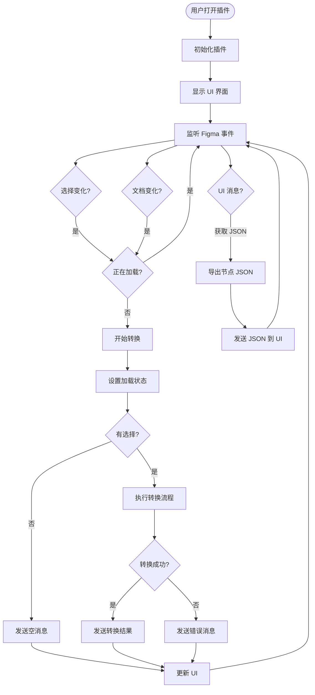
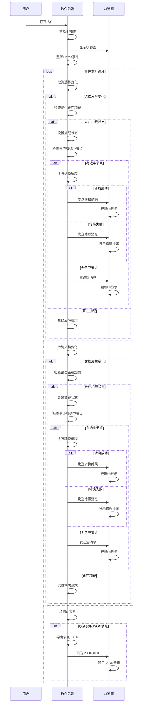
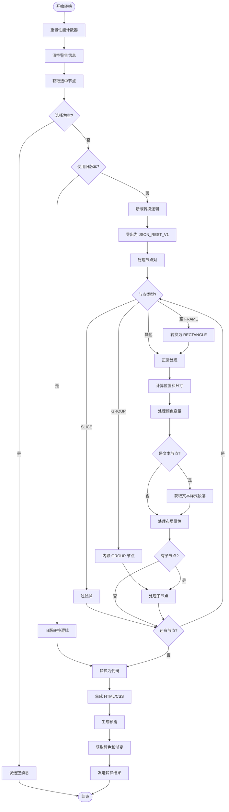
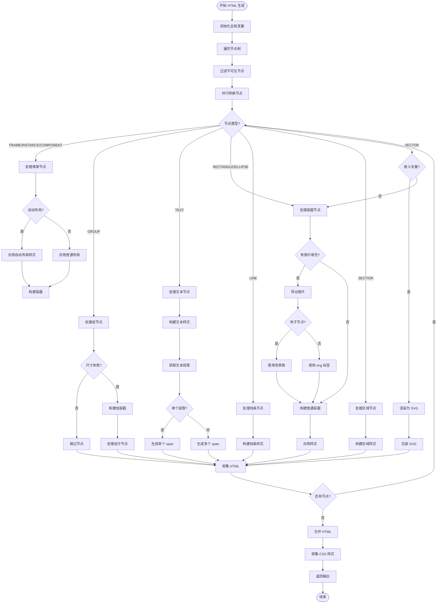
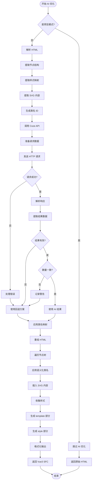
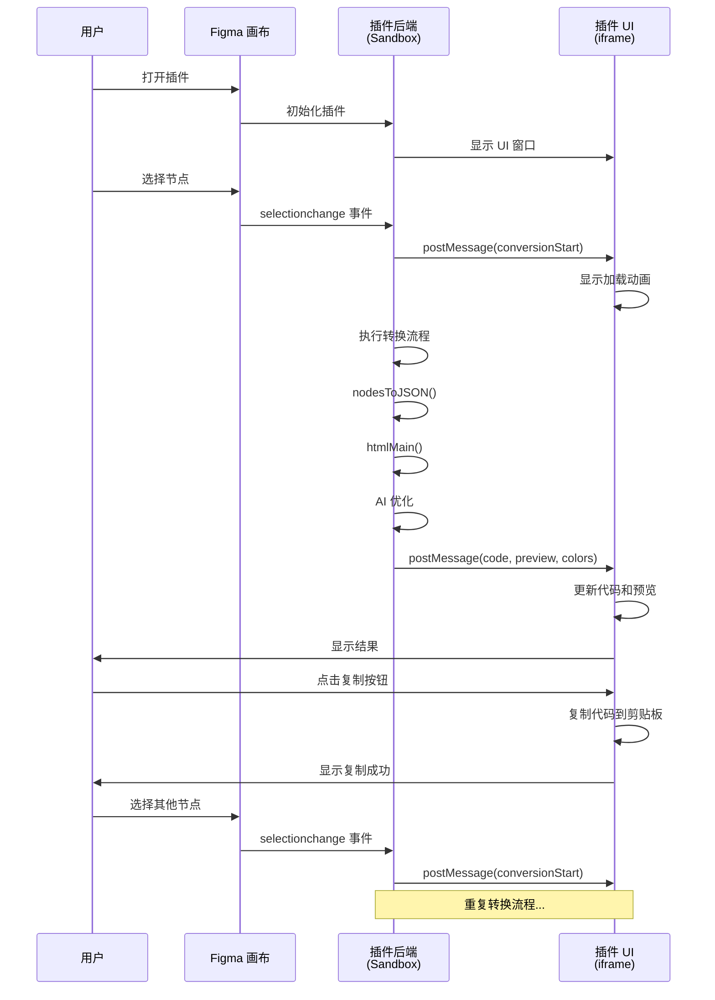
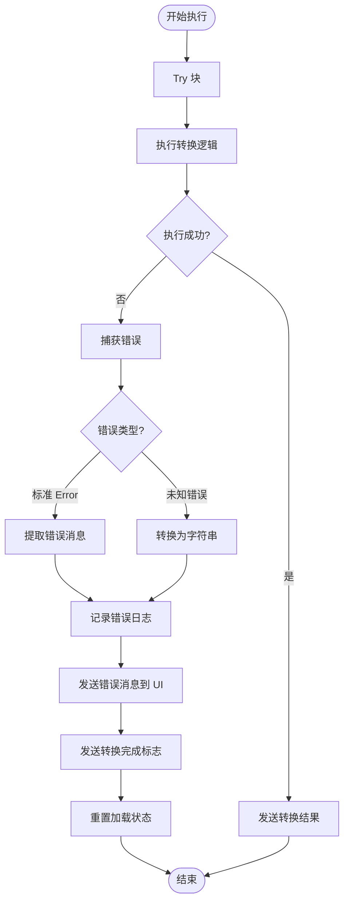
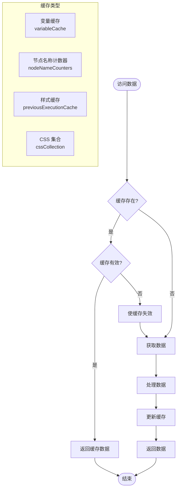

# Figma 转 Vue3 代码插件 - 工作流程图

## 1. 插件主工作流程

### 1.1 流程图

```mermaid
flowchart TD
    Start([用户打开插件]) --> Init[初始化插件]
    Init --> ShowUI[显示 UI 界面]
    ShowUI --> ListenEvents[监听 Figma 事件]
    
    ListenEvents --> SelectionChange{选择变化?}
    ListenEvents --> DocumentChange{文档变化?}
    ListenEvents --> UIMessage{UI 消息?}
    
    SelectionChange -->|是| CheckLoading{正在加载?}
    CheckLoading -->|否| StartConversion[开始转换]
    CheckLoading -->|是| ListenEvents
    
    DocumentChange -->|是| CheckLoading
    
    UIMessage -->|获取 JSON| ExportJSON[导出节点 JSON]
    
    ExportJSON --> SendJSON[发送 JSON 到 UI]
  SendJSON --> ListenEvents
    
    StartConversion --> SetLoading[设置加载状态]
    SetLoading --> CheckSelection{有选择?}
    
    CheckSelection -->|否| SendEmpty[发送空消息]
    CheckSelection -->|是| RunConversion[执行转换流程]
    
    SendEmpty --> UpdateUI[更新 UI]
    UpdateUI --> ListenEvents
    
    RunConversion --> ConversionSuccess{转换成功?}
    
    ConversionSuccess -->|是| SendResult[发送转换结果]
    ConversionSuccess -->|否| SendError[发送错误消息]
    
    SendResult --> UpdateUI
    SendError --> UpdateUI
```

### 1.2 时序图

```mermaid
sequenceDiagram
    participant User as 用户
    participant Plugin as 插件后端
    participant UI as UI界面

    User->>Plugin: 打开插件
    Plugin->>Plugin: 初始化插件
    Plugin->>UI: 显示UI界面
    Plugin->>Plugin: 监听Figma事件

    loop 事件监听循环
        Plugin->>Plugin: 检测选择变化
        alt 选择发生变化
            Plugin->>Plugin: 检查是否正在加载
            alt 未在加载状态
                Plugin->>Plugin: 设置加载状态
                Plugin->>Plugin: 检查是否有选中节点
                alt 有选中节点
                    Plugin->>Plugin: 执行转换流程
                    alt 转换成功
                        Plugin->>UI: 发送转换结果
                        UI->>UI: 更新UI显示
                    else 转换失败
                        Plugin->>UI: 发送错误消息
                        UI->>UI: 显示错误提示
                    end
                else 无选中节点
                    Plugin->>UI: 发送空消息
                    UI->>UI: 更新UI显示
                end
            else 正在加载
                Plugin->>Plugin: 忽略本次请求
            end
        end

        Plugin->>Plugin: 检测文档变化
        alt 文档发生变化
            Plugin->>Plugin: 检查是否正在加载
            alt 未在加载状态
                Plugin->>Plugin: 设置加载状态
                Plugin->>Plugin: 检查是否有选中节点
                alt 有选中节点
                    Plugin->>Plugin: 执行转换流程
                    alt 转换成功
                        Plugin->>UI: 发送转换结果
                        UI->>UI: 更新UI显示
                    else 转换失败
                        Plugin->>UI: 发送错误消息
                        UI->>UI: 显示错误提示
                    end
                else 无选中节点
                    Plugin->>UI: 发送空消息
                    UI->>UI: 更新UI显示
                end
            else 正在加载
                Plugin->>Plugin: 忽略本次请求
            end
        end

        Plugin->>Plugin: 检测UI消息
        alt 收到获取JSON消息
            Plugin->>Plugin: 导出节点JSON
            Plugin->>UI: 发送JSON到UI
            UI->>UI: 显示JSON数据
        end
    end
```

## 2. 节点转换流程

```mermaid
flowchart TD
    Start([开始转换]) --> ResetCounters[重置性能计数器]
    ResetCounters --> ClearWarnings[清空警告信息]
    ClearWarnings --> GetSelection[获取选中节点]
    
    GetSelection --> CheckEmpty{选择为空?}
    CheckEmpty -->|是| PostEmpty[发送空消息]
    CheckEmpty -->|否| CheckOldVersion{使用旧版本?}
    
    CheckOldVersion -->|是| OldConversion[旧版转换逻辑]
    CheckOldVersion -->|否| NewConversion[新版转换逻辑]
    
    OldConversion --> ConvertToCode
    
    NewConversion --> ExportJSON[导出为 JSON_REST_V1]
    ExportJSON --> ProcessNodes[处理节点对]
    
    ProcessNodes --> CheckNodeType{节点类型?}
    
    CheckNodeType -->|GROUP| InlineGroup[内联 GROUP 节点]
    CheckNodeType -->|空 FRAME| ConvertToRect[转换为 RECTANGLE]
    CheckNodeType -->|SLICE| FilterOut[过滤掉]
    CheckNodeType -->|其他| ProcessNormal[正常处理]
    
    InlineGroup --> ProcessChildren[处理子节点]
    ConvertToRect --> ProcessNormal
    FilterOut --> CheckMore{还有节点?}
    
    ProcessNormal --> CalcPosition[计算位置和尺寸]
    CalcPosition --> ProcessColors[处理颜色变量]
    ProcessColors --> ProcessText{是文本节点?}
    
    ProcessText -->|是| GetTextSegments[获取文本样式段落]
    ProcessText -->|否| ProcessLayout
    
    GetTextSegments --> ProcessLayout[处理布局属性]
    ProcessLayout --> CheckChildren{有子节点?}
    
    CheckChildren -->|是| ProcessChildren
    CheckChildren -->|否| CheckMore
    
    ProcessChildren --> CheckMore
    CheckMore -->|是| CheckNodeType
    CheckMore -->|否| ConvertToCode[转换为代码]
    
    ConvertToCode --> GenerateHTML[生成 HTML/CSS]
    GenerateHTML --> GeneratePreview[生成预览]
    GeneratePreview --> GetColors[获取颜色和渐变]
    GetColors --> PostResult[发送转换结果]
    
    PostEmpty --> End([结束])
    PostResult --> End
```

## 3. HTML 生成流程

```mermaid
flowchart TD
    Start([开始 HTML 生成]) --> InitGlobals[初始化全局变量]
    InitGlobals --> TraverseNodes[遍历节点树]
    
    TraverseNodes --> FilterVisible[过滤不可见节点]
    FilterVisible --> ParallelConvert[并行转换节点]
    
    ParallelConvert --> CheckNodeType{节点类型?}
    
    CheckNodeType -->|FRAME/INSTANCE/COMPONENT| HandleFrame[处理框架节点]
    CheckNodeType -->|GROUP| HandleGroup[处理组节点]
    CheckNodeType -->|TEXT| HandleText[处理文本节点]
    CheckNodeType -->|RECTANGLE/ELLIPSE| HandleContainer[处理容器节点]
    CheckNodeType -->|LINE| HandleLine[处理线条节点]
    CheckNodeType -->|SECTION| HandleSection[处理区域节点]
    CheckNodeType -->|VECTOR| CheckEmbed{嵌入矢量?}
    
    CheckEmbed -->|是| RenderSVG[渲染为 SVG]
    CheckEmbed -->|否| HandleContainer
    
    RenderSVG --> WrapSVG[包装 SVG]
    WrapSVG --> CollectHTML
    
    HandleFrame --> CheckAutoLayout{自动布局?}
    CheckAutoLayout -->|是| ApplyAutoLayout[应用自动布局样式]
    CheckAutoLayout -->|否| ApplyNormalLayout[应用普通布局]
    
    ApplyAutoLayout --> BuildContainer[构建容器]
    ApplyNormalLayout --> BuildContainer
    
    HandleGroup --> CheckSize{尺寸有效?}
    CheckSize -->|否| SkipNode[跳过节点]
    CheckSize -->|是| BuildGroupContainer[构建组容器]
    
    BuildGroupContainer --> ProcessGroupChildren[处理组子节点]
    ProcessGroupChildren --> CollectHTML
    
    HandleText --> BuildTextStyles[构建文本样式]
    BuildTextStyles --> GetTextSegments[获取文本段落]
    GetTextSegments --> CheckSegments{单个段落?}
    
    CheckSegments -->|是| SingleSpan[生成单个 span]
    CheckSegments -->|否| MultipleSpans[生成多个 span]
    
    SingleSpan --> CollectHTML[收集 HTML]
    MultipleSpans --> CollectHTML
    
    HandleContainer --> CheckImageFill{有图片填充?}
    CheckImageFill -->|是| ExportImage[导出图片]
    CheckImageFill -->|否| BuildNormalContainer[构建普通容器]
    
    ExportImage --> CheckChildren{有子节点?}
    CheckChildren -->|是| UseBackground[使用背景图]
    CheckChildren -->|否| UseImgTag[使用 img 标签]
    
    UseBackground --> BuildNormalContainer
    UseImgTag --> BuildNormalContainer
    
    BuildNormalContainer --> ApplyStyles[应用样式]
    ApplyStyles --> CollectHTML
    
    HandleLine --> BuildLineStyles[构建线条样式]
    BuildLineStyles --> CollectHTML
    
    HandleSection --> BuildSectionStyles[构建区域样式]
    BuildSectionStyles --> CollectHTML
    
    SkipNode --> CollectHTML
    
    CollectHTML --> CheckMoreNodes{还有节点?}
    CheckMoreNodes -->|是| CheckNodeType
    CheckMoreNodes -->|否| JoinHTML[合并 HTML]
    
    JoinHTML --> CollectCSS[收集 CSS 样式]
    CollectCSS --> ReturnOutput[返回输出]
    ReturnOutput --> End([结束])
```

## 4. AI 优化流程

```mermaid
flowchart TD
    Start([开始 AI 优化]) --> CheckMode{是预览模式?}
    CheckMode -->|是| SkipAI[跳过 AI 优化]
    CheckMode -->|否| ParseHTML[解析 HTML]
    
    ParseHTML --> ExtractNodes[提取节点结构]
    ExtractNodes --> ExtractStyles[提取样式映射]
    ExtractStyles --> ExtractSVG[提取 SVG 内容]
    ExtractSVG --> GenerateClassIDs[生成类名 ID]
    
    GenerateClassIDs --> CallCoze[调用 Coze API]
    CallCoze --> PrepareRequest[准备请求数据]
    
    PrepareRequest --> SendRequest[发送 HTTP 请求]
    SendRequest --> CheckResponse{请求成功?}
    
    CheckResponse -->|否| HandleError[处理错误]
    CheckResponse -->|是| ParseResponse[解析响应]
    
    HandleError --> UseFallback[使用回退方案]
    UseFallback --> ApplyClassNames
    
    ParseResponse --> ExtractResult[提取结果数据]
    ExtractResult --> ValidateResult{结果有效?}
    
    ValidateResult -->|否| UseFallback
    ValidateResult -->|是| CheckCount{数量一致?}
    
    CheckCount -->|否| LogWarning[记录警告]
    CheckCount -->|是| UseAIResult[使用 AI 结果]
    
    LogWarning --> UseFallback
    UseAIResult --> ApplyClassNames[应用类名映射]
    
    ApplyClassNames --> ReconstructHTML[重组 HTML]
    ReconstructHTML --> TraverseTree[遍历节点树]
    
    TraverseTree --> ApplySemanticClass[应用语义化类名]
    ApplySemanticClass --> InsertSVG[插入 SVG 内容]
    InsertSVG --> CollectStyles[收集样式]
    
    CollectStyles --> GenerateTemplate[生成 template 部分]
    GenerateTemplate --> GenerateStyle[生成 style 部分]
    GenerateStyle --> FormatOutput[格式化输出]
    
    FormatOutput --> ReturnVueSFC[返回 Vue3 SFC]
    
    SkipAI --> ReturnOriginal[返回原始 HTML]
    
    ReturnVueSFC --> End([结束])
    ReturnOriginal --> End
```

## 5. 消息通信流程

```mermaid
sequenceDiagram
    participant User as 用户
    participant Figma as Figma 画布
    participant Backend as 插件后端<br/>(Sandbox)
    participant UI as 插件 UI<br/>(iframe)
    
    User->>Figma: 打开插件
    Figma->>Backend: 初始化插件
    Backend->>UI: 显示 UI 窗口
    
    User->>Figma: 选择节点
    Figma->>Backend: selectionchange 事件
    Backend->>UI: postMessage(conversionStart)
    UI->>UI: 显示加载动画
    
    Backend->>Backend: 执行转换流程
    Backend->>Backend: nodesToJSON()
    Backend->>Backend: htmlMain()
    Backend->>Backend: AI 优化
    
    Backend->>UI: postMessage(code, preview, colors)
    UI->>UI: 更新代码和预览
    UI->>User: 显示结果
    
    User->>UI: 点击复制按钮
    UI->>UI: 复制代码到剪贴板
    UI->>User: 显示复制成功
    

    
    User->>Figma: 选择其他节点
    Figma->>Backend: selectionchange 事件
    Backend->>UI: postMessage(conversionStart)
    Note over Backend,UI: 重复转换流程...
```

## 6. 错误处理流程

```mermaid
flowchart TD
    Start([开始执行]) --> TryBlock[Try 块]
    TryBlock --> Execute[执行转换逻辑]
    
    Execute --> CheckSuccess{执行成功?}
    CheckSuccess -->|是| SendResult[发送转换结果]
    CheckSuccess -->|否| CatchError[捕获错误]
    
    CatchError --> CheckErrorType{错误类型?}
    
    CheckErrorType -->|标准 Error| ExtractMessage[提取错误消息]
    CheckErrorType -->|未知错误| ConvertToString[转换为字符串]
    
    ExtractMessage --> LogError[记录错误日志]
    ConvertToString --> LogError
    
    LogError --> SendErrorMsg[发送错误消息到 UI]
    SendErrorMsg --> SendComplete[发送转换完成标志]
    
    SendComplete --> ResetLoading[重置加载状态]
    ResetLoading --> End([结束])
    
    SendResult --> End
```

## 7. 性能监控流程

```mermaid
flowchart TD
    Start([开始转换]) --> ResetCounters[重置性能计数器]
    
    ResetCounters --> StartTimer1[开始计时: 节点转换]
    StartTimer1 --> NodeConversion[执行节点转换]
    NodeConversion --> EndTimer1[结束计时: 节点转换]
    EndTimer1 --> LogTime1[记录: nodesToJSON 耗时]
    
    LogTime1 --> StartTimer2[开始计时: 代码生成]
    StartTimer2 --> CodeGeneration[执行代码生成]
    CodeGeneration --> EndTimer2[结束计时: 代码生成]
    EndTimer2 --> LogTime2[记录: convertToCode 耗时]
    
    LogTime2 --> StartTimer3[开始计时: 预览生成]
    StartTimer3 --> PreviewGeneration[执行预览生成]
    PreviewGeneration --> EndTimer3[结束计时: 预览生成]
    EndTimer3 --> LogTime3[记录: generatePreview 耗时]
    
    LogTime3 --> StartTimer4[开始计时: 颜色处理]
    StartTimer4 --> ColorProcessing[执行颜色处理]
    ColorProcessing --> EndTimer4[结束计时: 颜色处理]
    EndTimer4 --> LogTime4[记录: 颜色处理耗时]
    
    LogTime4 --> CalcTotal[计算总耗时]
    CalcTotal --> LogTotal[记录总耗时]
    
    LogTotal --> LogAPICalls[记录 API 调用统计]
    LogAPICalls --> LogGetNodeById[getNodeByIdAsync 统计]
    LogGetNodeById --> LogGetTextSegments[getStyledTextSegments 统计]
    LogGetTextSegments --> LogProcessColors[processColorVariables 统计]
    
    LogProcessColors --> OutputStats[输出性能统计]
    OutputStats --> End([结束])
```

## 8. 缓存管理流程

```mermaid
flowchart TD
    Start([访问数据]) --> CheckCache{缓存存在?}
    
    CheckCache -->|是| ValidateCache{缓存有效?}
    CheckCache -->|否| FetchData[获取数据]
    
    ValidateCache -->|是| ReturnCached[返回缓存数据]
    ValidateCache -->|否| InvalidateCache[使缓存失效]
    
    InvalidateCache --> FetchData
    
    FetchData --> ProcessData[处理数据]
    ProcessData --> UpdateCache[更新缓存]
    UpdateCache --> ReturnData[返回数据]
    
    ReturnCached --> End([结束])
    ReturnData --> End
    
    subgraph 缓存类型
        VC[变量缓存<br/>variableCache]
        NC[节点名称计数器<br/>nodeNameCounters]
        SC[样式缓存<br/>previousExecutionCache]
        CC[CSS 集合<br/>cssCollection]
    end
```

