# 系统架构设计

## 整体系统架构
系统的整体架构图mermaid代码：

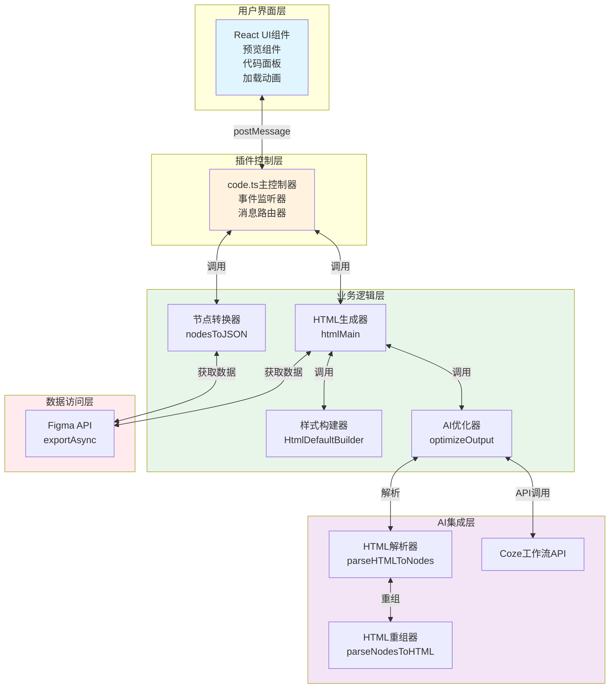
```mermaid
graph TD
    subgraph 用户界面层
        UI[React UI组件<br/>预览组件<br/>代码面板<br/>加载动画]
    end

    subgraph 插件控制层
        Controller[code.ts主控制器<br/>事件监听器<br/>消息路由器]
    end

    subgraph 业务逻辑层
        NodeConverter[节点转换器<br/>nodesToJSON]
        HtmlGenerator[HTML生成器<br/>htmlMain]
        StyleBuilder[样式构建器<br/>HtmlDefaultBuilder]
        AIOptimizer[AI优化器<br/>optimizeOutput]
    end

    subgraph AI集成层
        HTMLParser[HTML解析器<br/>parseHTMLToNodes]
        CozeAPI[Coze工作流API]
        HTML重组器[HTML重组器<br/>parseNodesToHTML]
    end

    subgraph 数据访问层
        FigmaAPI[Figma API<br/>exportAsync]
    end

    UI <-->|postMessage| Controller
    Controller <-->|调用| NodeConverter
    Controller <-->|调用| HtmlGenerator
    HtmlGenerator <-->|调用| StyleBuilder
    HtmlGenerator <-->|调用| AIOptimizer
    AIOptimizer <-->|解析| HTMLParser
    AIOptimizer <-->|API调用| CozeAPI
    HTMLParser <-->|重组| HTML重组器
    NodeConverter <-->|获取数据| FigmaAPI
    HtmlGenerator <-->|获取数据| FigmaAPI

    style UI fill:#e1f5fe
    style Controller fill:#fff3e0
    style 业务逻辑层 fill:#e8f5e9
    style AI集成层 fill:#f3e5f5
    style 数据访问层 fill:#ffebee
```

## 数据流架构
系统的完整转换流程mermaid代码：

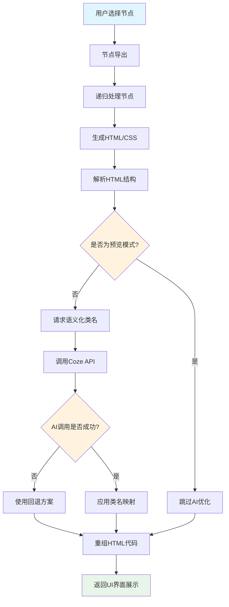
```mermaid
flowchart TD
    A[用户选择节点] --> B[节点导出]
    B --> C[递归处理节点]
    C --> D[生成HTML/CSS]
    D --> E[解析HTML结构]
    E --> F{是否为预览模式?}
    F -->|是| G[跳过AI优化]
    F -->|否| H[请求语义化类名]
    H --> I[调用Coze API]
    I --> J{AI调用是否成功?}
    J -->|否| K[使用回退方案]
    J -->|是| L[应用类名映射]
    K --> M[重组HTML代码]
    L --> M
    G --> M
    M --> N[返回UI界面展示]

    style A fill:#e1f5fe
    style F fill:#fff3e0
    style J fill:#fff3e0
    style N fill:#e8f5e9
```

系统的消息通信架构mermaid代码：

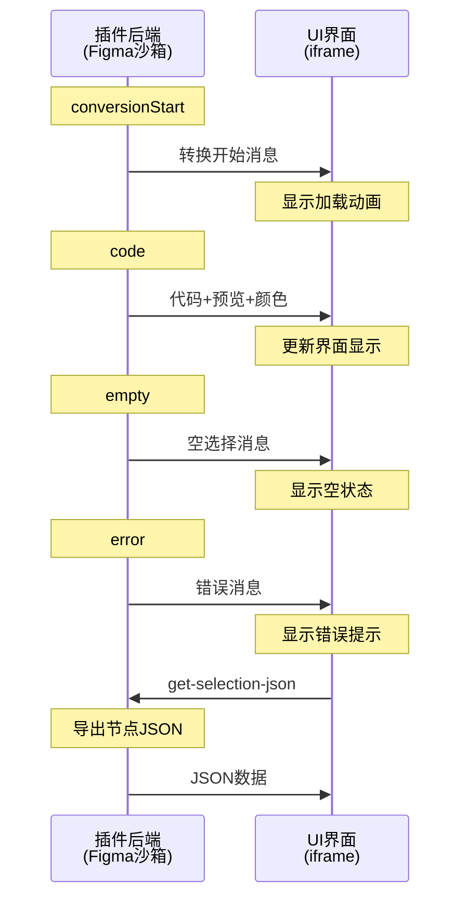
```mermaid
sequenceDiagram
    participant 后端 as 插件后端<br/>(Figma沙箱)
    participant UI as UI界面<br/>(iframe)

    Note over 后端: conversionStart
    后端->>UI: 转换开始消息
    Note over UI: 显示加载动画

    Note over 后端: code
    后端->>UI: 代码+预览+颜色
    Note over UI: 更新界面显示

    Note over 后端: empty
    后端->>UI: 空选择消息
    Note over UI: 显示空状态

    Note over 后端: error
    后端->>UI: 错误消息
    Note over UI: 显示错误提示

    UI->>后端: get-selection-json
    Note over 后端: 导出节点JSON
    后端->>UI: JSON数据
```

## Monorepo项目结构
系统的Monorepo项目结构mermaid代码：

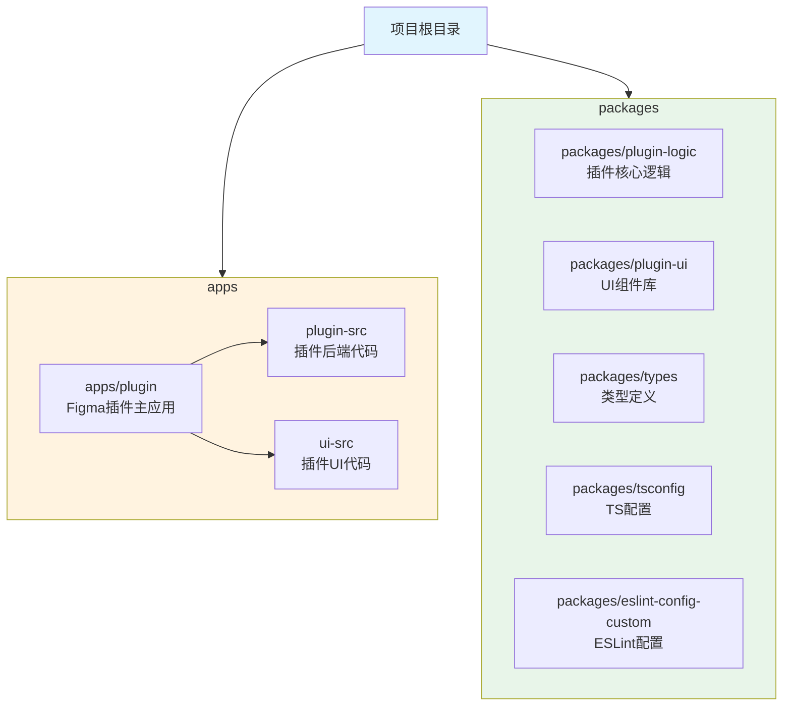
```mermaid
graph TD
    Root[项目根目录]

    subgraph apps
        plugin[apps/plugin<br/>Figma插件主应用]
        plugin-src[plugin-src<br/>插件后端代码]
        ui-src[ui-src<br/>插件UI代码]
    end

    subgraph packages
        plugin-logic[packages/plugin-logic<br/>插件核心逻辑]
        plugin-ui[packages/plugin-ui<br/>UI组件库]
        types[packages/types<br/>类型定义]
        tsconfig[packages/tsconfig<br/>TS配置]
        eslint-config[packages/eslint-config-custom<br/>ESLint配置]
    end

    Root --> apps
    Root --> packages
    plugin --> plugin-src
    plugin --> ui-src

    style Root fill:#e1f5fe
    style apps fill:#fff3e0
    style packages fill:#e8f5e9
```

## Monorepo包依赖结构
系统的Monorepo包依赖结构mermaid代码：

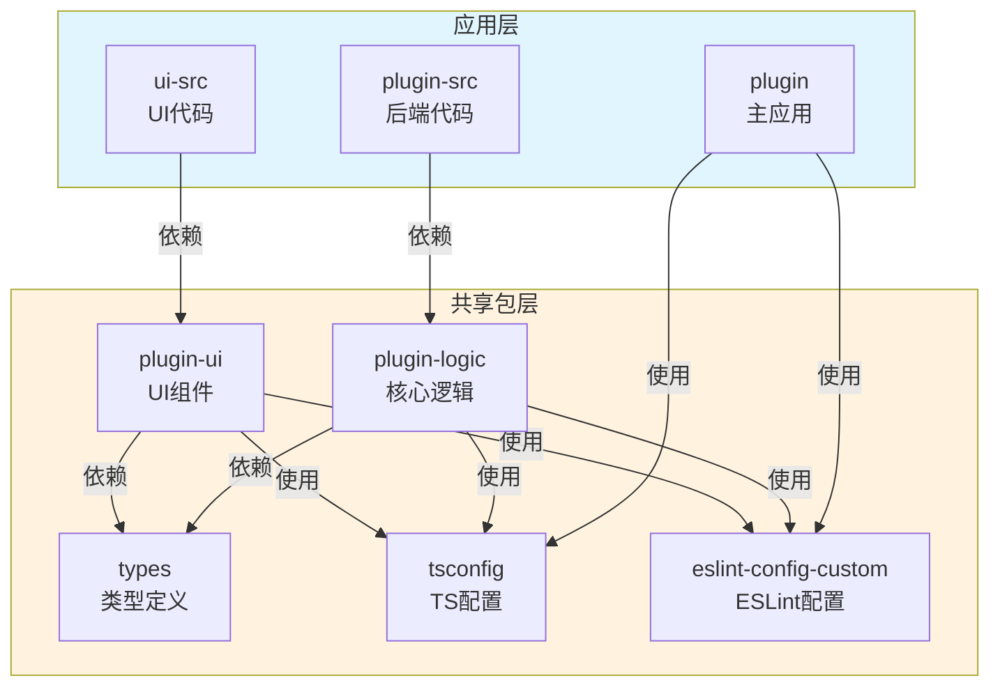
```mermaid
graph TD
    subgraph 应用层
        plugin[plugin<br/>主应用]
        plugin-src[plugin-src<br/>后端代码]
        ui-src[ui-src<br/>UI代码]
    end

    subgraph 共享包层
        plugin-logic[plugin-logic<br/>核心逻辑]
        plugin-ui[plugin-ui<br/>UI组件]
        types[types<br/>类型定义]
        tsconfig[tsconfig<br/>TS配置]
        eslint-config[eslint-config-custom<br/>ESLint配置]
    end

    plugin-src -->|依赖| plugin-logic
    ui-src -->|依赖| plugin-ui
    plugin-logic -->|依赖| types
    plugin-ui -->|依赖| types
    plugin -->|使用| tsconfig
    plugin-logic -->|使用| tsconfig
    plugin-ui -->|使用| tsconfig
    plugin -->|使用| eslint-config
    plugin-logic -->|使用| eslint-config
    plugin-ui -->|使用| eslint-config

    style 应用层 fill:#e1f5fe
    style 共享包层 fill:#fff3e0
```

# 系统功能设计

## 插件主工作流程
插件主工作流程流程图mermaid代码：

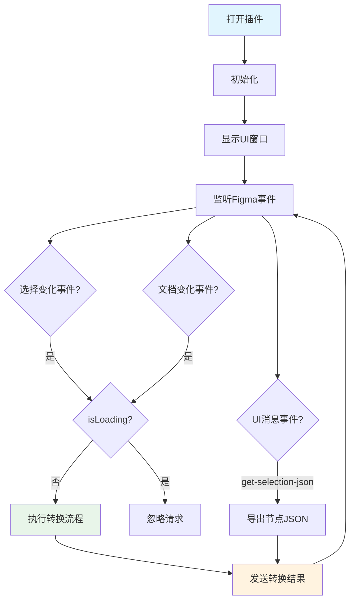
```mermaid
flowchart TD
    A[打开插件] --> B[初始化]
    B --> C[显示UI窗口]
    C --> D[监听Figma事件]

    D --> E{选择变化事件?}
    E -->|是| F{isLoading?}
    F -->|否| G[执行转换流程]
    F -->|是| H[忽略请求]
    G --> I[发送转换结果]
    I --> D

    D --> J{文档变化事件?}
    J -->|是| F

    D --> K{UI消息事件?}
    K -->|get-selection-json| L[导出节点JSON]
    L --> I

    style A fill:#e1f5fe
    style G fill:#e8f5e9
    style I fill:#fff3e0
```

## 节点转换流程
节点转换流程mermaid代码：

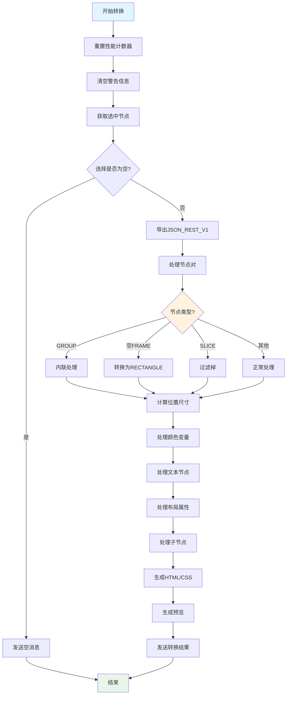
```mermaid
flowchart TD
    A[开始转换] --> B[重置性能计数器]
    B --> C[清空警告信息]
    C --> D[获取选中节点]
    D --> E{选择是否为空?}
    E -->|是| F[发送空消息]
    E -->|否| G[导出JSON_REST_V1]
    G --> H[处理节点对]
    H --> I{节点类型?}
    I -->|GROUP| J[内联处理]
    I -->|空FRAME| K[转换为RECTANGLE]
    I -->|SLICE| L[过滤掉]
    I -->|其他| M[正常处理]

    J --> N[计算位置尺寸]
    K --> N
    L --> N
    M --> N
    N --> O[处理颜色变量]
    O --> P[处理文本节点]
    P --> Q[处理布局属性]
    Q --> R[处理子节点]
    R --> S[生成HTML/CSS]
    S --> T[生成预览]
    T --> U[发送转换结果]

    F --> V[结束]
    U --> V

    style A fill:#e1f5fe
    style I fill:#fff3e0
    style V fill:#e8f5e9
```

## HTML生成流程
HTML生成流程mermaid代码：

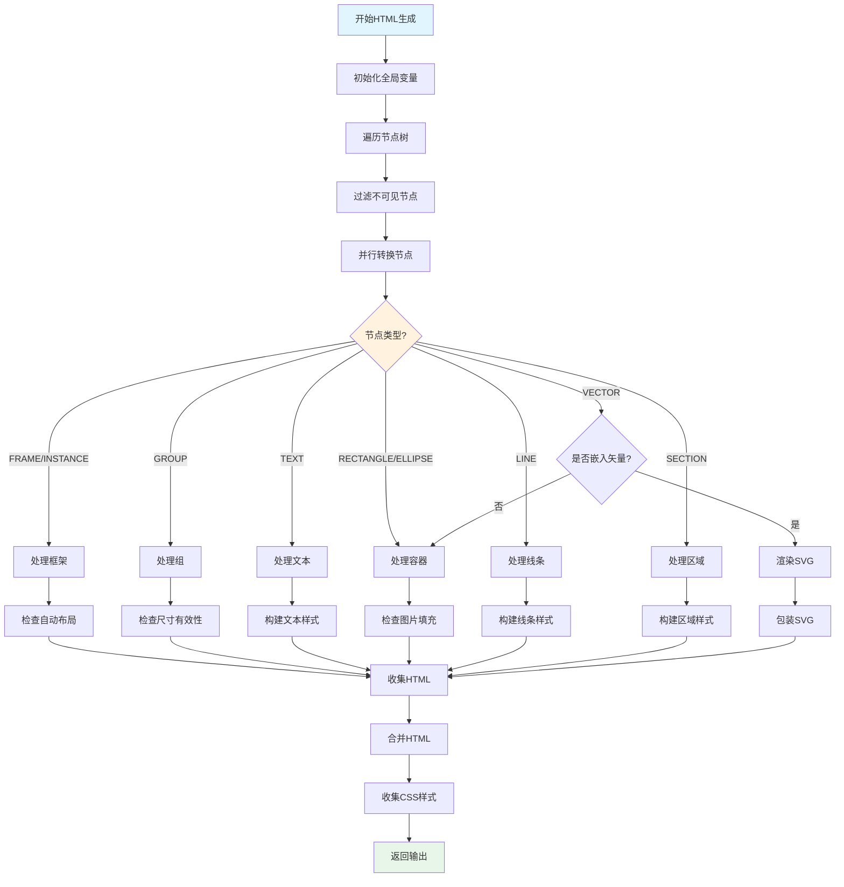
```mermaid
flowchart TD
    A[开始HTML生成] --> B[初始化全局变量]
    B --> C[遍历节点树]
    C --> D[过滤不可见节点]
    D --> E[并行转换节点]

    E --> F{节点类型?}
    F -->|FRAME/INSTANCE| G[处理框架]
    F -->|GROUP| H[处理组]
    F -->|TEXT| I[处理文本]
    F -->|RECTANGLE/ELLIPSE| J[处理容器]
    F -->|LINE| K[处理线条]
    F -->|SECTION| L[处理区域]
    F -->|VECTOR| M{是否嵌入矢量?}

    M -->|是| N[渲染SVG]
    M -->|否| J

    G --> O[检查自动布局]
    H --> P[检查尺寸有效性]
    I --> Q[构建文本样式]
    J --> R[检查图片填充]
    K --> S[构建线条样式]
    L --> T[构建区域样式]
    N --> U[包装SVG]

    O --> V
    P --> V
    Q --> V
    R --> V
    S --> V
    T --> V
    U --> V
    V[收集HTML] --> W[合并HTML]
    W --> X[收集CSS样式]
    X --> Y[返回输出]

    style A fill:#e1f5fe
    style F fill:#fff3e0
    style Y fill:#e8f5e9
```

## AI优化流程
AI优化流程时序图mermaid代码：

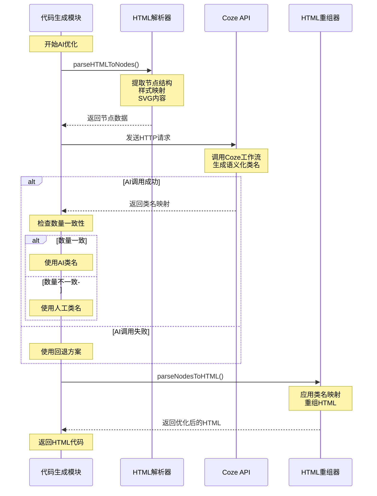
```mermaid
sequenceDiagram
    participant 代码生成模块 as 代码生成模块
    participant 解析器 as HTML解析器
    participant Coze as Coze API
    participant 重组器 as HTML重组器

    Note over 代码生成模块: 开始AI优化
    代码生成模块->>解析器: parseHTMLToNodes()
    Note over 解析器: 提取节点结构<br/>样式映射<br/>SVG内容
    解析器-->>代码生成模块: 返回节点数据

    代码生成模块->>Coze: 发送HTTP请求
    Note over Coze: 调用Coze工作流<br/>生成语义化类名
    alt AI调用成功
        Coze-->>代码生成模块: 返回类名映射
        Note over 代码生成模块: 检查数量一致性
        alt 数量一致
            Note over 代码生成模块: 使用AI类名
        else 数量不一致
            Note over 代码生成模块: 使用人工类名
        end
    else AI调用失败
        Note over 代码生成模块: 使用回退方案
    end

    代码生成模块->>重组器: parseNodesToHTML()
    Note over 重组器: 应用类名映射<br/>重组HTML
    重组器-->>代码生成模块: 返回优化后的HTML

    Note over 代码生成模块: 返回HTML代码
```

## 消息通信流程
消息通信流程时序图mermaid代码：

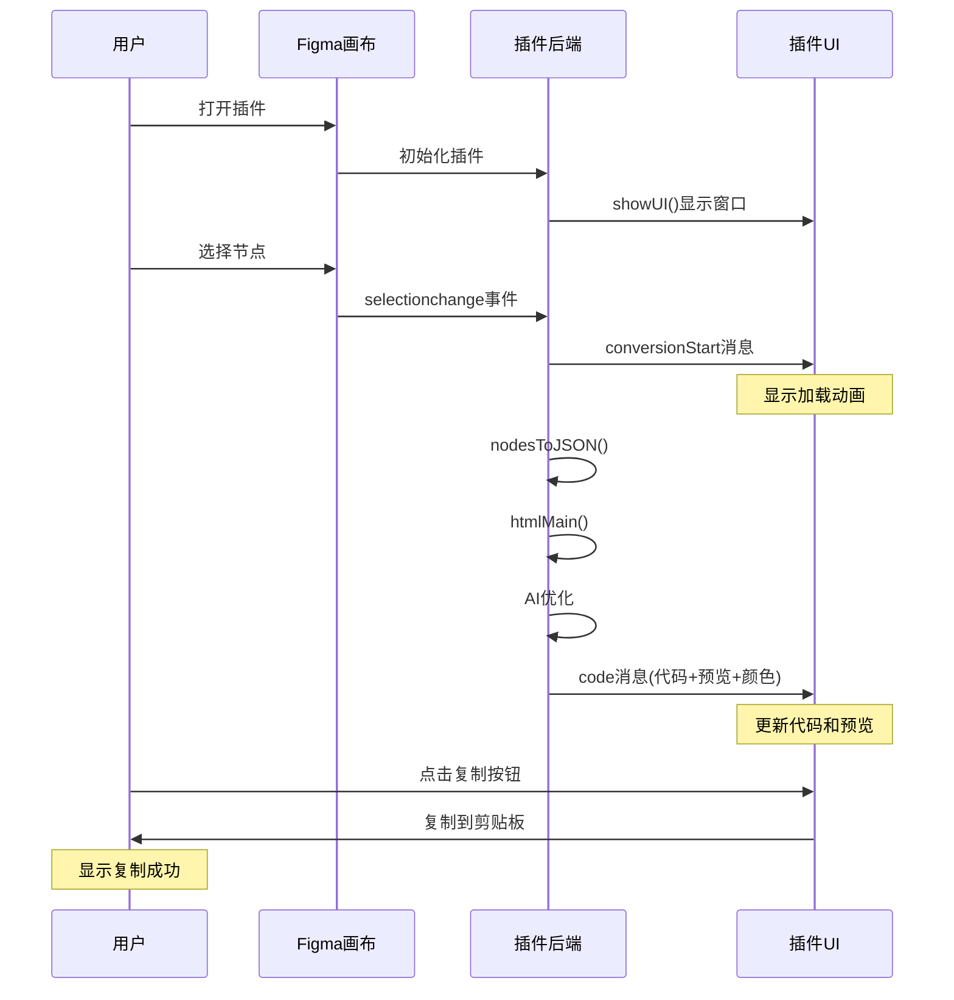
```mermaid
sequenceDiagram
    participant 用户
    participant Figma as Figma画布
    participant 后端 as 插件后端
    participant UI as 插件UI

    用户->>Figma: 打开插件
    Figma->>后端: 初始化插件
    后端->>UI: showUI()显示窗口

    用户->>Figma: 选择节点
    Figma->>后端: selectionchange事件
    后端->>UI: conversionStart消息
    Note over UI: 显示加载动画

    后端->>后端: nodesToJSON()
    后端->>后端: htmlMain()
    后端->>后端: AI优化

    后端->>UI: code消息(代码+预览+颜色)
    Note over UI: 更新代码和预览

    用户->>UI: 点击复制按钮
    UI->>用户: 复制到剪贴板
    Note over 用户: 显示复制成功
```

## 错误处理流程
错误处理流程mermaid代码：

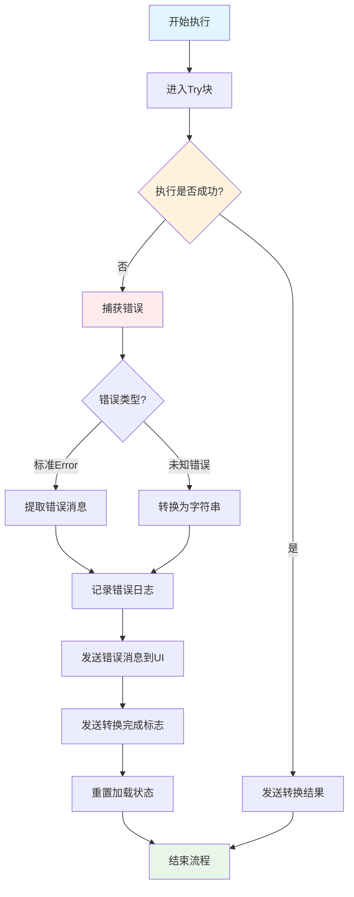
```mermaid
flowchart TD
    A[开始执行] --> B[进入Try块]
    B --> C{执行是否成功?}
    C -->|是| D[发送转换结果]
    C -->|否| E[捕获错误]

    E --> F{错误类型?}
    F -->|标准Error| G[提取错误消息]
    F -->|未知错误| H[转换为字符串]

    G --> I[记录错误日志]
    H --> I
    I --> J[发送错误消息到UI]
    J --> K[发送转换完成标志]
    K --> L[重置加载状态]
    L --> M[结束流程]

    D --> M

    style A fill:#e1f5fe
    style C fill:#fff3e0
    style E fill:#ffebee
    style M fill:#e8f5e9
```

## 性能监控流程
性能监控流程时序图mermaid代码：

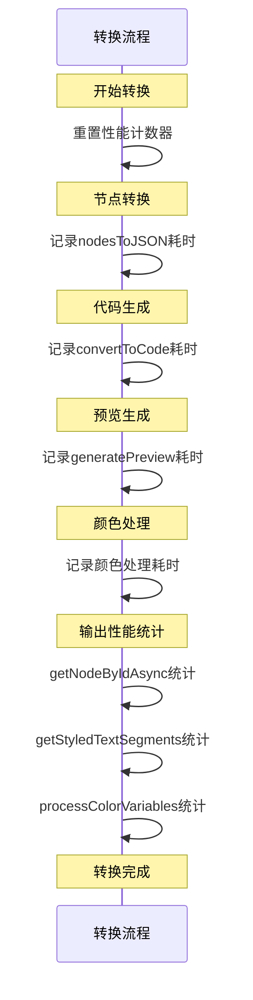
```mermaid
sequenceDiagram
    participant 转换流程 as 转换流程

    Note over 转换流程: 开始转换
    转换流程->>转换流程: 重置性能计数器

    Note over 转换流程: 节点转换
    转换流程->>转换流程: 记录nodesToJSON耗时

    Note over 转换流程: 代码生成
    转换流程->>转换流程: 记录convertToCode耗时

    Note over 转换流程: 预览生成
    转换流程->>转换流程: 记录generatePreview耗时

    Note over 转换流程: 颜色处理
    转换流程->>转换流程: 记录颜色处理耗时

    Note over 转换流程: 输出性能统计
    转换流程->>转换流程: getNodeByIdAsync统计
    转换流程->>转换流程: getStyledTextSegments统计
    转换流程->>转换流程: processColorVariables统计

    Note over 转换流程: 转换完成
```

## 缓存管理流程
缓存管理流程mermaid代码：

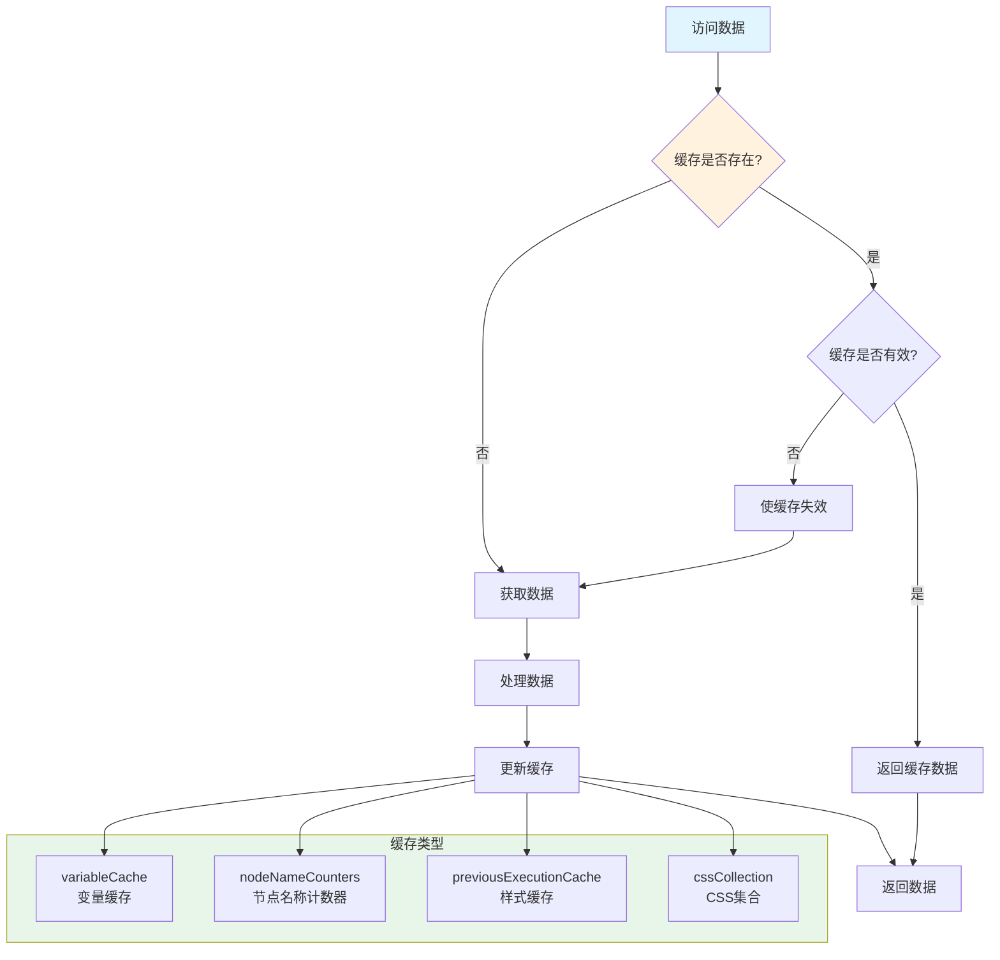
```mermaid
flowchart TD
    A[访问数据] --> B{缓存是否存在?}
    B -->|是| C{缓存是否有效?}
    B -->|否| D[获取数据]

    C -->|是| E[返回缓存数据]
    C -->|否| F[使缓存失效]
    F --> D

    D --> G[处理数据]
    G --> H[更新缓存]
    H --> I[返回数据]

    E --> I

    subgraph 缓存类型
        J[variableCache<br/>变量缓存]
        K[nodeNameCounters<br/>节点名称计数器]
        L[previousExecutionCache<br/>样式缓存]
        M[cssCollection<br/>CSS集合]
    end

    H --> J
    H --> K
    H --> L
    H --> M

    style A fill:#e1f5fe
    style B fill:#fff3e0
    style 缓存类型 fill:#e8f5e9
```

# 性能优化架构

## 并行处理策略
并行处理策略mermaid代码：

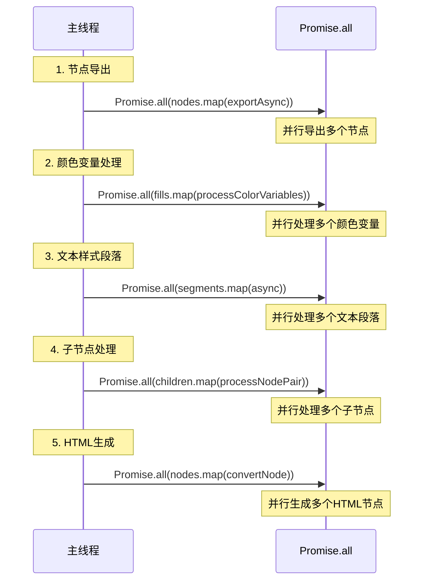
```mermaid
sequenceDiagram
    participant 主线程 as 主线程
    participant Promise as Promise.all

    Note over 主线程: 1. 节点导出
    主线程->>Promise: Promise.all(nodes.map(exportAsync))
    Note over Promise: 并行导出多个节点

    Note over 主线程: 2. 颜色变量处理
    主线程->>Promise: Promise.all(fills.map(processColorVariables))
    Note over Promise: 并行处理多个颜色变量

    Note over 主线程: 3. 文本样式段落
    主线程->>Promise: Promise.all(segments.map(async))
    Note over Promise: 并行处理多个文本段落

    Note over 主线程: 4. 子节点处理
    主线程->>Promise: Promise.all(children.map(processNodePair))
    Note over Promise: 并行处理多个子节点

    Note over 主线程: 5. HTML生成
    主线程->>Promise: Promise.all(nodes.map(convertNode))
    Note over Promise: 并行生成多个HTML节点
```

## 缓存架构
缓存架构mermaid代码：

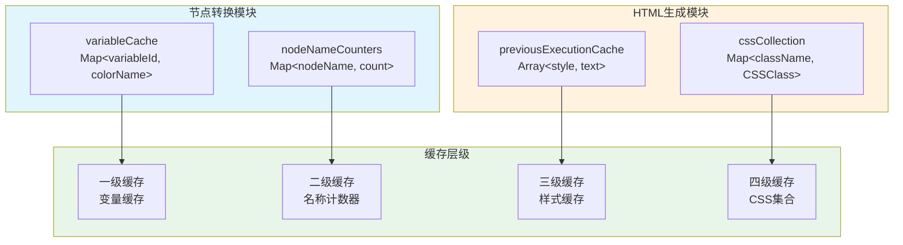
```mermaid
graph TD
    subgraph 节点转换模块
        VC[variableCache<br/>Map&lt;variableId, colorName&gt;]
        NNC[nodeNameCounters<br/>Map&lt;nodeName, count&gt;]
    end

    subgraph HTML生成模块
        PEC[previousExecutionCache<br/>Array&lt;style, text&gt;]
        CC[cssCollection<br/>Map&lt;className, CSSClass&gt;]
    end

    subgraph 缓存层级
        L1[一级缓存<br/>变量缓存]
        L2[二级缓存<br/>名称计数器]
        L3[三级缓存<br/>样式缓存]
        L4[四级缓存<br/>CSS集合]
    end

    VC --> L1
    NNC --> L2
    PEC --> L3
    CC --> L4

    style 节点转换模块 fill:#e1f5fe
    style HTML生成模块 fill:#fff3e0
    style 缓存层级 fill:#e8f5e9
```

# 安全架构

## 沙箱隔离
沙箱隔离mermaid代码：

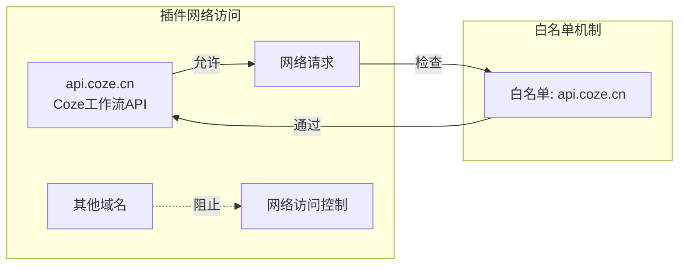
```mermaid
graph LR
    subgraph 插件网络访问
        API1[api.coze.cn<br/>Coze工作流API] -->|允许| 请求[网络请求]
        API2[其他域名] -.->|阻止| 阻止[网络访问控制]
    end

    subgraph 白名单机制
        白名单[白名单: api.coze.cn]
    end

    请求 -->|检查| 白名单
    白名单 -->|通过| API1
```

## 网络访问控制
网络访问控制mermaid代码：

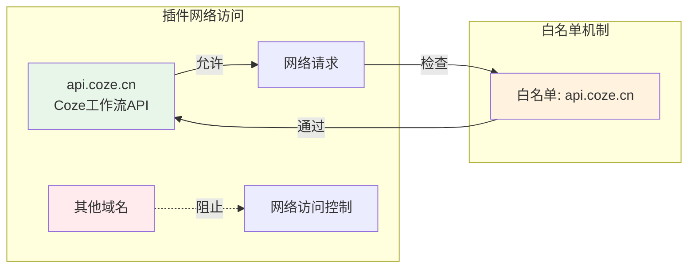
```mermaid
graph LR
    subgraph 插件网络访问
        API1[api.coze.cn<br/>Coze工作流API] -->|允许| 请求[网络请求]
        API2[其他域名] -.->|阻止| 阻止[网络访问控制]
    end

    subgraph 白名单机制
        白名单[白名单: api.coze.cn]
    end

    请求 -->|检查| 白名单
    白名单 -->|通过| API1

    style API1 fill:#e8f5e9
    style API2 fill:#ffebee
    style 白名单 fill:#fff3e0
```

# 监控与调试架构

## 性能监控
性能监控mermaid代码：

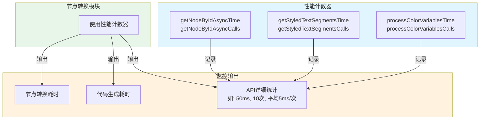
```mermaid
graph TD
    subgraph 性能计数器
        PT1[getNodeByIdAsyncTime<br/>getNodeByIdAsyncCalls]
        PT2[getStyledTextSegmentsTime<br/>getStyledTextSegmentsCalls]
        PT3[processColorVariablesTime<br/>processColorVariablesCalls]
    end

    subgraph 监控输出
        MO1[节点转换耗时]
        MO2[代码生成耗时]
        MO3[API详细统计<br/>如: 50ms, 10次, 平均5ms/次]
    end

    PT1 -->|记录| MO3
    PT2 -->|记录| MO3
    PT3 -->|记录| MO3

    subgraph 节点转换模块
        NTM[使用性能计数器]
    end

    NTM -->|输出| MO1
    NTM -->|输出| MO2
    NTM -->|输出| MO3

    style 性能计数器 fill:#e1f5fe
    style 监控输出 fill:#fff3e0
    style 节点转换模块 fill:#e8f5e9
```

## 调试工具架构
调试工具架构mermaid代码：

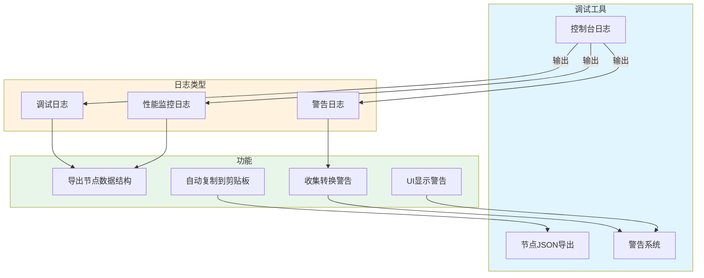
```mermaid
graph TD
    subgraph 调试工具
        DT1[控制台日志]
        DT2[节点JSON导出]
        DT3[警告系统]
    end

    subgraph 日志类型
        LT1[调试日志]
        LT2[性能监控日志]
        LT3[警告日志]
    end

    subgraph 功能
        F1[导出节点数据结构]
        F2[自动复制到剪贴板]
        F3[收集转换警告]
        F4[UI显示警告]
    end

    DT1 -->|输出| LT1
    DT1 -->|输出| LT2
    DT1 -->|输出| LT3

    LT1 --> F1
    LT2 --> F1
    LT3 --> F3

    F2 --> DT2
    F3 --> DT3
    F4 --> DT3

    style 调试工具 fill:#e1f5fe
    style 日志类型 fill:#fff3e0
    style 功能 fill:#e8f5e9
```
