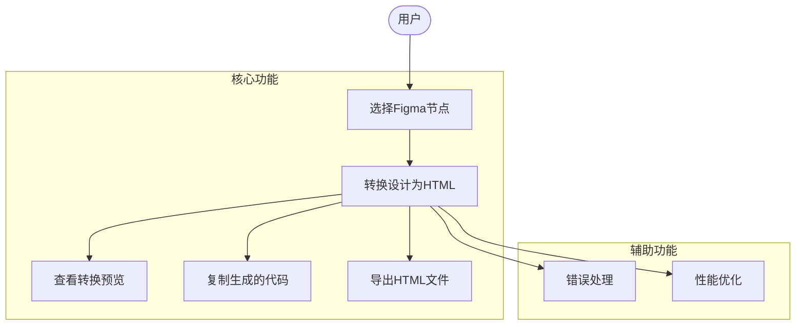

# Figma to HTML 插件需求分析与设计文档

## 一、项目概述

### 1.1 项目背景
Figma to HTML 是一款基于 Figma 平台的插件，旨在帮助设计师和开发者快速将 Figma 设计稿转换为高质量的 HTML 代码，提高开发效率，减少手动编码工作量。

### 1.2 项目目标
- 提供直观的用户界面，支持实时预览转换效果
- 生成语义化、可维护的 HTML 代码
- 支持多种框架和配置选项
- 保持设计稿与生成代码的视觉一致性

## 二、用户角色

### 2.1 主要用户角色

| 角色 | 描述 | 需求 |
|------|------|------|
| **UI/UX 设计师** | 负责创建 Figma 设计稿，需要将设计转换为可交付的前端代码 | - 快速将设计稿转换为 HTML<br>- 保持设计视觉一致性<br>- 支持导出高质量代码 |
| **前端开发者** | 负责实现前端功能，需要基于设计稿快速生成基础代码 | - 生成语义化、可维护的代码<br>- 支持自定义配置<br>- 减少手动编码工作量 |
| **产品经理** | 负责项目管理和协调，需要确保设计与开发的一致性 | - 提高团队协作效率<br>- 减少沟通成本<br>- 确保设计还原度 |

## 三、功能概述

### 3.1 核心功能

#### 3.1.1 设计稿转换
- 支持选择单个或多个 Figma 节点进行转换
- 实时预览转换效果
- 生成完整的 HTML 代码结构

#### 3.1.2 代码生成
- 生成语义化 HTML 标签
- 提取并转换样式为 CSS
- 支持响应式设计
- 处理图片和矢量资源

#### 3.1.3 配置管理
- **当前状态**：插件使用固定的默认配置，不支持用户自定义设置

#### 3.1.4 预览与导出
- 实时预览转换效果
- 复制生成的代码
- 导出完整的 HTML 文件

### 3.2 辅助功能

#### 3.2.1 错误处理
- 提供友好的错误提示
- 处理无效选择和转换失败
- 支持恢复机制

#### 3.2.2 性能优化
- 处理大型设计稿的性能优化
- 支持代码压缩和优化
- 异步处理避免界面阻塞

## 四、用例分析

### 4.1 用例图



### 4.2 主要用例描述

#### 用例 1：转换设计稿为 HTML

| 用例信息 | 详情 |
|----------|------|
| **用例名称** | 转换设计稿为 HTML |
| **参与者** | 设计师、开发者 |
| **前置条件** | - 插件已安装并启动<br>- Figma 文档已打开<br>- 已选择要转换的设计节点 |
| **基本流程** | 1. 用户选择 Figma 设计节点<br>2. 插件自动检测选择并启动转换<br>3. 生成 HTML 代码<br>4. 显示实时预览<br>5. 用户可复制或导出代码 |
| **扩展流程** | - 转换失败时显示错误提示<br>- 支持配置转换选项 |


#### 用例 2：预览与导出

| 用例信息 | 详情 |
|----------|------|
| **用例名称** | 预览与导出 |
| **参与者** | 设计师、开发者 |
| **前置条件** | - 已完成设计转换 |
| **基本流程** | 1. 查看实时预览效果<br>2. 复制生成的代码<br>3. 导出完整 HTML 文件 |
| **扩展流程** | - 支持缩放预览<br>- 支持代码格式化 |

## 五、系统约束

### 5.1 技术约束

#### 5.1.1 平台约束
- 基于 Figma 插件平台开发，受限于 Figma API
- 必须遵循 Figma 插件开发规范
- 性能受限于 Figma 插件运行环境

#### 5.1.2 浏览器约束
- 支持现代浏览器（Chrome、Firefox、Safari 等）
- 兼容 Figma 内置浏览器环境

#### 5.1.3 资源约束
- 处理大型设计稿时可能受限于内存和性能
- 图片和资源处理受限于 Figma 导出能力

### 5.2 业务约束

#### 5.2.1 设计约束
- 转换结果受限于设计稿的质量和结构
- 复杂交互效果可能无法完全自动转换
- 需要遵循前端开发最佳实践

#### 5.2.2 性能约束
- 转换大型设计稿可能需要较长时间
- 实时预览可能受限于网络和设备性能

## 六、系统架构

### 6.1 整体架构

```
+-------------------+     +-------------------+     +-------------------+
|   Figma 客户端    |     |   插件 UI 层      |     |   转换引擎层      |
+-------------------+     +-------------------+     +-------------------+
          |                        |                        |
          | 1. 选择设计节点        | 2. 发送转换请求        | 3. 执行转换逻辑
          |----------------------->|----------------------->|
          |                        |                        |
          | 4. 返回转换结果        | 5. 显示预览和代码      | 6. 生成 HTML/CSS
          |<-----------------------|<-----------------------|
          |                        |                        |
```

### 6.2 模块划分

#### 6.2.1 UI 层 (plugin-ui)
- 提供用户界面和交互
- 实时预览转换效果

#### 6.2.2 转换引擎层 (backend)
- 处理 Figma 节点转换
- 生成 HTML 和 CSS 代码
- 资源处理和优化

#### 6.2.3 插件层 (plugin-src)
- 与 Figma API 交互
- 处理选择和文档变更
- 管理插件生命周期

## 七、非功能性需求

### 7.1 性能需求
- 转换小型设计稿（<100 节点）应在 2 秒内完成
- 转换中型设计稿（100-500 节点）应在 5 秒内完成
- 支持处理大型设计稿（>500 节点）

### 7.2 可用性需求
- 界面响应时间 < 100ms
- 提供清晰的错误提示和帮助信息
- 支持键盘快捷键和常用操作

### 7.3 可维护性需求
- 代码结构清晰，模块化设计
- 提供详细的文档和注释
- 支持单元测试和集成测试

### 7.4 兼容性需求
- 兼容 Figma 最新版本
- 支持主流浏览器
- 适配不同屏幕尺寸


## 附录

### 术语表

| 术语 | 定义 |
|------|------|
| **Figma** | 基于浏览器的 UI/UX 设计工具 |
| **HTML** | 超文本标记语言，用于创建网页结构 |
| **CSS** | 层叠样式表，用于描述网页样式 |
| **插件** | 扩展 Figma 功能的应用程序 |

### 参考资料

- [Figma 插件开发文档](https://www.figma.com/plugin-docs/)
- [HTML 5 规范](https://html.spec.whatwg.org/)
- [CSS 3 规范](https://www.w3.org/TR/css-2018/)