# Figma 转 Vue3 代码插件 - 架构图与类图

## 1. 系统架构图

### 1.1 整体系统架构

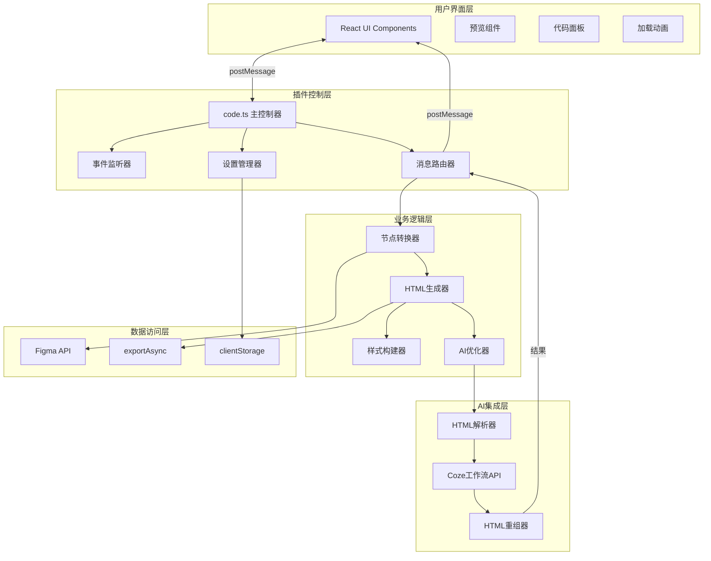
```mermaid
graph TB
    subgraph "用户界面层"
        UI[React UI Components]
        Preview[预览组件]
        CodePanel[代码面板]
        Loading[加载动画]
    end
    
    subgraph "插件控制层"
        PluginMain[code.ts 主控制器]
        EventListener[事件监听器]
        SettingsManager[设置管理器]
        MessageRouter[消息路由器]
    end
    
    subgraph "业务逻辑层"
        NodeConverter[节点转换器]
        HTMLGenerator[HTML生成器]
        StyleBuilder[样式构建器]
        AIOptimizer[AI优化器]
    end
    
    subgraph "AI集成层"
        HTMLParser[HTML解析器]
        CozeAPI[Coze工作流API]
        HTMLRebuilder[HTML重组器]
    end
    
    subgraph "数据访问层"
        FigmaAPI[Figma API]
        ExportAPI[exportAsync]
        StorageAPI[clientStorage]
    end
    
    UI <-->|postMessage| PluginMain
    PluginMain --> EventListener
    PluginMain --> SettingsManager
    PluginMain --> MessageRouter
    
    MessageRouter --> NodeConverter
    NodeConverter --> HTMLGenerator
    HTMLGenerator --> StyleBuilder
    HTMLGenerator --> AIOptimizer
    
    AIOptimizer --> HTMLParser
    HTMLParser --> CozeAPI
    CozeAPI --> HTMLRebuilder
    
    NodeConverter --> FigmaAPI
    HTMLGenerator --> ExportAPI
    SettingsManager --> StorageAPI
    
    HTMLRebuilder -->|结果| MessageRouter
    MessageRouter -->|postMessage| UI
```

### 1.2 Monorepo 项目结构

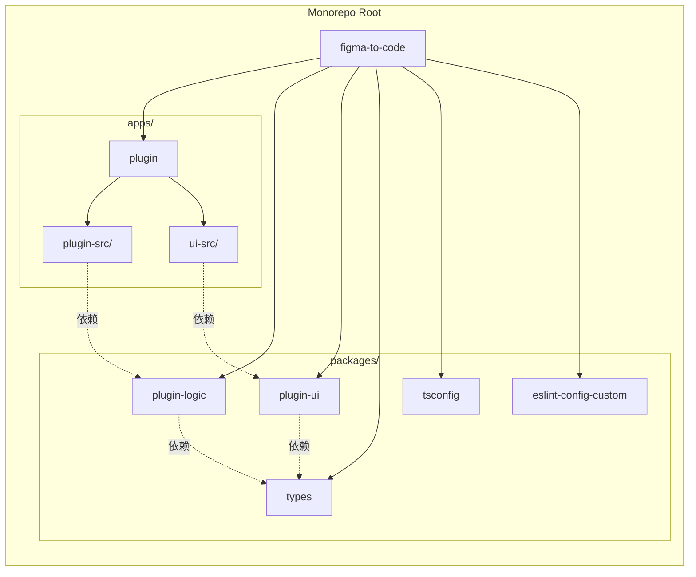
```mermaid
graph LR
    subgraph "Monorepo Root"
        Root[figma-to-code]
        
        subgraph "apps/"
            Plugin[plugin]
            PluginSrc[plugin-src/]
            UISrc[ui-src/]
        end
        
        subgraph "packages/"
            Logic[plugin-logic]
            UILib[plugin-ui]
            Types[types]
            TSConfig[tsconfig]
            ESLint[eslint-config-custom]
        end
        
        Root --> Plugin
        Plugin --> PluginSrc
        Plugin --> UISrc
        
        Root --> Logic
        Root --> UILib
        Root --> Types
        Root --> TSConfig
        Root --> ESLint
        
        PluginSrc -.依赖.-> Logic
        UISrc -.依赖.-> UILib
        Logic -.依赖.-> Types
        UILib -.依赖.-> Types
    end
```

## 2. 数据流架构图

### 2.1 完整转换流程

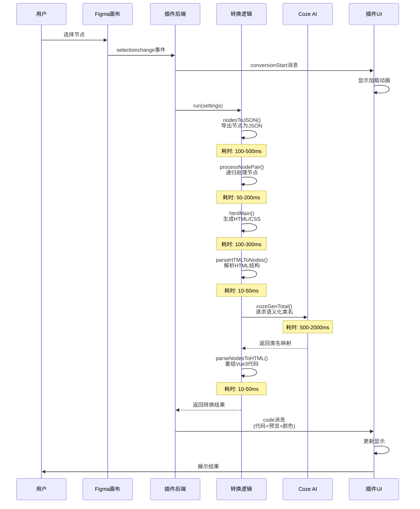
```mermaid
sequenceDiagram
    participant User as 用户
    participant Figma as Figma画布
    participant Plugin as 插件后端
    participant Logic as 转换逻辑
    participant AI as Coze AI
    participant UI as 插件UI
    
    User->>Figma: 选择节点
    Figma->>Plugin: selectionchange事件
    Plugin->>UI: conversionStart消息
    UI->>UI: 显示加载动画
    
    Plugin->>Logic: run(settings)
    
    Logic->>Logic: nodesToJSON()<br/>导出节点为JSON
    Note over Logic: 耗时: 100-500ms
    
    Logic->>Logic: processNodePair()<br/>递归处理节点
    Note over Logic: 耗时: 50-200ms
    
    Logic->>Logic: htmlMain()<br/>生成HTML/CSS
    Note over Logic: 耗时: 100-300ms
    
    Logic->>Logic: parseHTMLToNodes()<br/>解析HTML结构
    Note over Logic: 耗时: 10-50ms
    
    Logic->>AI: cozeGenTotal()<br/>请求语义化类名
    Note over AI: 耗时: 500-2000ms
    AI-->>Logic: 返回类名映射
    
    Logic->>Logic: parseNodesToHTML()<br/>重组Vue3代码
    Note over Logic: 耗时: 10-50ms
    
    Logic-->>Plugin: 返回转换结果
    Plugin->>UI: code消息<br/>(代码+预览+颜色)
    UI->>UI: 更新显示
    UI->>User: 展示结果
```

### 2.2 消息通信架构

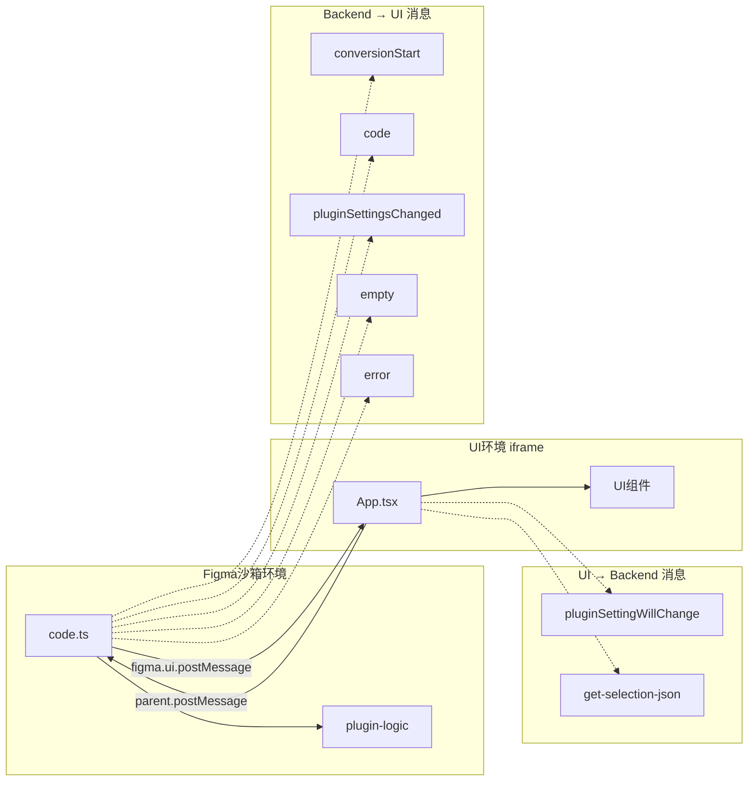
```mermaid
graph LR
    subgraph "Figma沙箱环境"
        Backend[code.ts]
        Logic[plugin-logic]
        Backend --> Logic
    end
    
    subgraph "UI环境 iframe"
        UIApp[App.tsx]
        Components[UI组件]
        UIApp --> Components
    end
    
    Backend -->|figma.ui.postMessage| UIApp
    UIApp -->|parent.postMessage| Backend
    
    subgraph "Backend → UI 消息"
        M1[conversionStart]
        M2[code]
        M3[pluginSettingsChanged]
        M4[empty]
        M5[error]
    end
    
    subgraph "UI → Backend 消息"
        M6[pluginSettingWillChange]
        M7[get-selection-json]
    end
    
    Backend -.-> M1
    Backend -.-> M2
    Backend -.-> M3
    Backend -.-> M4
    Backend -.-> M5
    
    UIApp -.-> M6
    UIApp -.-> M7
```

## 3. 核心模块类图

### 3.1 节点转换模块类图

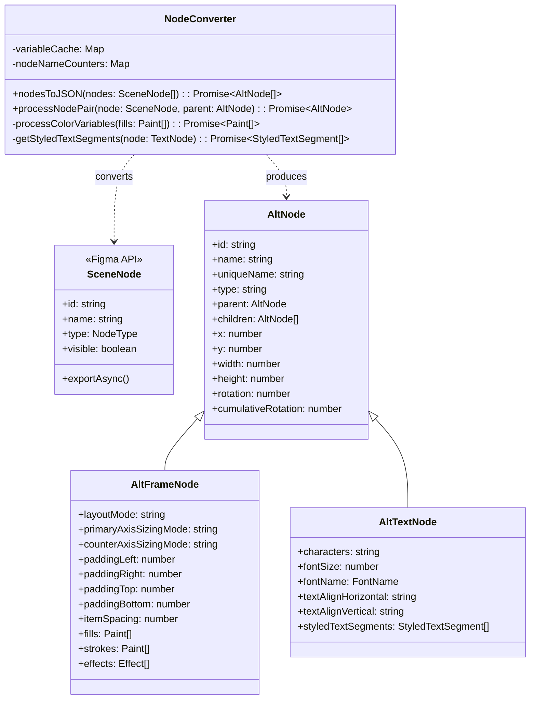
```mermaid
classDiagram
    class SceneNode {
        <<Figma API>>
        +id: string
        +name: string
        +type: NodeType
        +visible: boolean
        +exportAsync()
    }
    
    class AltNode {
        +id: string
        +name: string
        +uniqueName: string
        +type: string
        +parent: AltNode
        +children: AltNode[]
        +x: number
        +y: number
        +width: number
        +height: number
        +rotation: number
        +cumulativeRotation: number
    }
    
    class AltFrameNode {
        +layoutMode: string
        +primaryAxisSizingMode: string
        +counterAxisSizingMode: string
        +paddingLeft: number
        +paddingRight: number
        +paddingTop: number
        +paddingBottom: number
        +itemSpacing: number
        +fills: Paint[]
        +strokes: Paint[]
        +effects: Effect[]
    }
    
    class AltTextNode {
        +characters: string
        +fontSize: number
        +fontName: FontName
        +textAlignHorizontal: string
        +textAlignVertical: string
        +styledTextSegments: StyledTextSegment[]
    }
    
    class NodeConverter {
        -variableCache: Map
        -nodeNameCounters: Map
        +nodesToJSON(nodes: SceneNode[]): Promise~AltNode[]~
        +processNodePair(node: SceneNode, parent: AltNode): Promise~AltNode~
        -processColorVariables(fills: Paint[]): Promise~Paint[]~
        -getStyledTextSegments(node: TextNode): Promise~StyledTextSegment[]~
    }
    
    AltNode <|-- AltFrameNode
    AltNode <|-- AltTextNode
    NodeConverter ..> SceneNode : converts
    NodeConverter ..> AltNode : produces
```

### 3.2 HTML生成模块类图

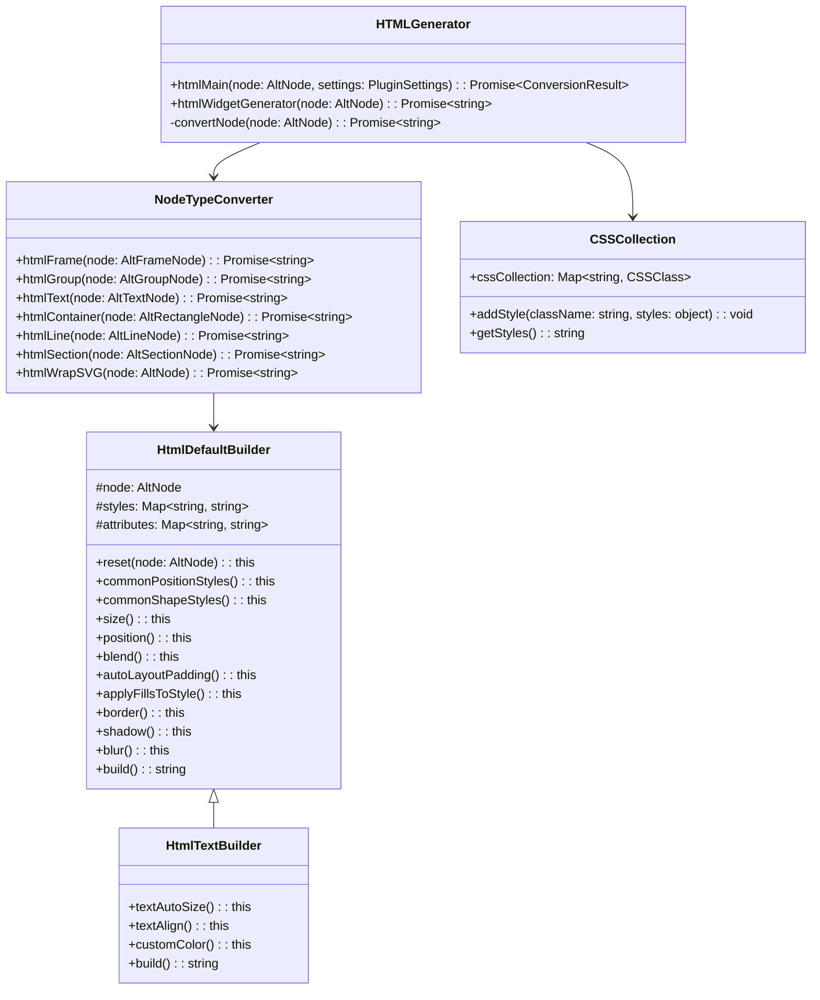
```mermaid
classDiagram
    class HTMLGenerator {
        +htmlMain(node: AltNode, settings: PluginSettings): Promise~ConversionResult~
        +htmlWidgetGenerator(node: AltNode): Promise~string~
        -convertNode(node: AltNode): Promise~string~
    }
    
    class NodeTypeConverter {
        +htmlFrame(node: AltFrameNode): Promise~string~
        +htmlGroup(node: AltGroupNode): Promise~string~
        +htmlText(node: AltTextNode): Promise~string~
        +htmlContainer(node: AltRectangleNode): Promise~string~
        +htmlLine(node: AltLineNode): Promise~string~
        +htmlSection(node: AltSectionNode): Promise~string~
        +htmlWrapSVG(node: AltNode): Promise~string~
    }
    
    class HtmlDefaultBuilder {
        #node: AltNode
        #styles: Map~string, string~
        #attributes: Map~string, string~
        +reset(node: AltNode): this
        +commonPositionStyles(): this
        +commonShapeStyles(): this
        +size(): this
        +position(): this
        +blend(): this
        +autoLayoutPadding(): this
        +applyFillsToStyle(): this
        +border(): this
        +shadow(): this
        +blur(): this
        +build(): string
    }
    
    class HtmlTextBuilder {
        +textAutoSize(): this
        +textAlign(): this
        +customColor(): this
        +build(): string
    }
    
    class CSSCollection {
        +cssCollection: Map~string, CSSClass~
        +addStyle(className: string, styles: object): void
        +getStyles(): string
    }
    
    HTMLGenerator --> NodeTypeConverter
    NodeTypeConverter --> HtmlDefaultBuilder
    HtmlDefaultBuilder <|-- HtmlTextBuilder
    HTMLGenerator --> CSSCollection
```

### 3.3 AI优化模块类图

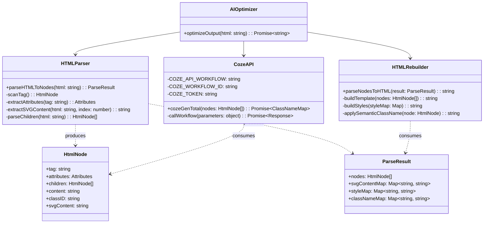
```mermaid
classDiagram
    class AIOptimizer {
        +optimizeOutput(html: string): Promise~string~
    }
    
    class HTMLParser {
        +parseHTMLToNodes(html: string): ParseResult
        -scanTag(): HtmlNode
        -extractAttributes(tag: string): Attributes
        -extractSVGContent(html: string, index: number): string
        -parseChildren(html: string): HtmlNode[]
    }
    
    class HtmlNode {
        +tag: string
        +attributes: Attributes
        +children: HtmlNode[]
        +content: string
        +classID: string
        +svgContent: string
    }
    
    class ParseResult {
        +nodes: HtmlNode[]
        +svgContentMap: Map~string, string~
        +styleMap: Map~string, string~
        +classNameMap: Map~string, string~
    }
    
    class CozeAPI {
        -COZE_API_WORKFLOW: string
        -COZE_WORKFLOW_ID: string
        -COZE_TOKEN: string
        +cozeGenTotal(nodes: HtmlNode[]): Promise~ClassNameMap~
        -callWorkflow(parameters: object): Promise~Response~
    }
    
    class HTMLRebuilder {
        +parseNodesToHTML(result: ParseResult): string
        -buildTemplate(nodes: HtmlNode[]): string
        -buildStyles(styleMap: Map): string
        -applySemanticClassName(node: HtmlNode): string
    }
    
    AIOptimizer --> HTMLParser
    HTMLParser ..> HtmlNode : produces
    HTMLParser ..> ParseResult : produces
    AIOptimizer --> CozeAPI
    CozeAPI ..> HtmlNode : consumes
    AIOptimizer --> HTMLRebuilder
    HTMLRebuilder ..> ParseResult : consumes
```

### 3.4 UI组件类图

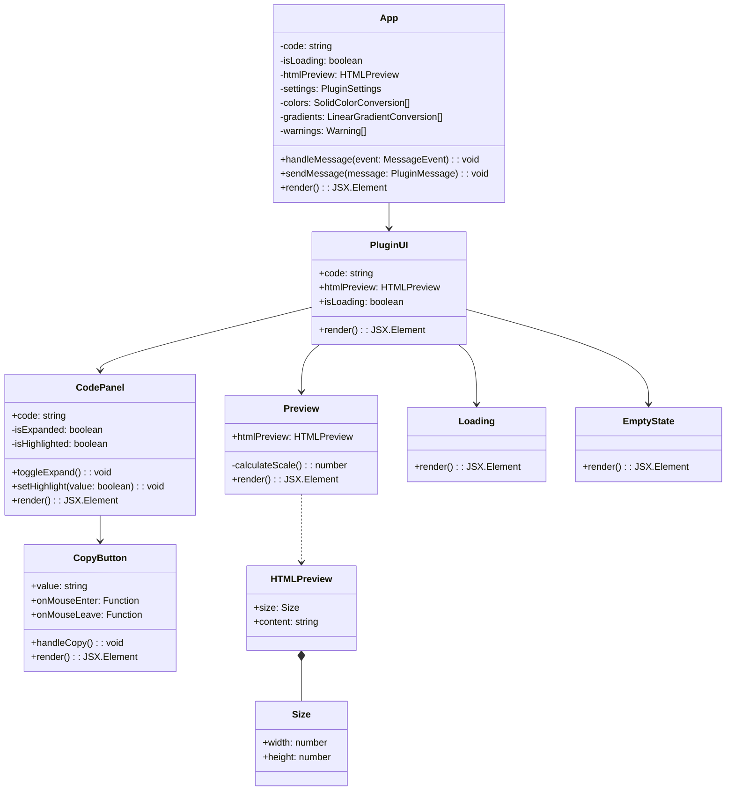
```mermaid
classDiagram
    class App {
        -code: string
        -isLoading: boolean
        -htmlPreview: HTMLPreview
        -settings: PluginSettings
        -colors: SolidColorConversion[]
        -gradients: LinearGradientConversion[]
        -warnings: Warning[]
        +handleMessage(event: MessageEvent): void
        +sendMessage(message: PluginMessage): void
        +render(): JSX.Element
    }
    
    class PluginUI {
        +code: string
        +htmlPreview: HTMLPreview
        +isLoading: boolean
        +render(): JSX.Element
    }
    
    class Preview {
        +htmlPreview: HTMLPreview
        -calculateScale(): number
        +render(): JSX.Element
    }
    
    class CodePanel {
        +code: string
        -isExpanded: boolean
        -isHighlighted: boolean
        +toggleExpand(): void
        +setHighlight(value: boolean): void
        +render(): JSX.Element
    }
    
    class CopyButton {
        +value: string
        +onMouseEnter: Function
        +onMouseLeave: Function
        +handleCopy(): void
        +render(): JSX.Element
    }
    
    class Loading {
        +render(): JSX.Element
    }
    
    class EmptyState {
        +render(): JSX.Element
    }
    
    class HTMLPreview {
        +size: Size
        +content: string
    }
    
    class Size {
        +width: number
        +height: number
    }
    
    App --> PluginUI
    PluginUI --> Preview
    PluginUI --> CodePanel
    PluginUI --> Loading
    PluginUI --> EmptyState
    CodePanel --> CopyButton
    Preview ..> HTMLPreview
    HTMLPreview *-- Size
```

## 4. 性能优化架构图

### 4.1 并行处理策略

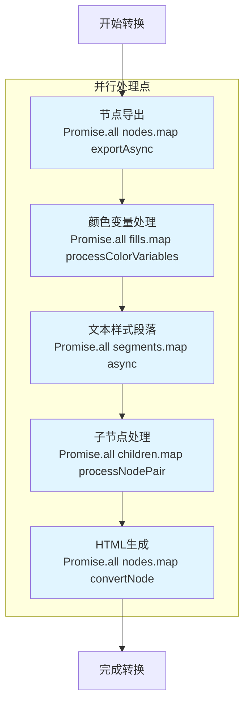
```mermaid
graph TB
    subgraph "并行处理点"
        P1[节点导出<br/>Promise.all nodes.map exportAsync]
        P2[颜色变量处理<br/>Promise.all fills.map processColorVariables]
        P3[文本样式段落<br/>Promise.all segments.map async]
        P4[子节点处理<br/>Promise.all children.map processNodePair]
        P5[HTML生成<br/>Promise.all nodes.map convertNode]
    end
    
    Start[开始转换] --> P1
    P1 --> P2
    P2 --> P3
    P3 --> P4
    P4 --> P5
    P5 --> End[完成转换]
    
    style P1 fill:#e1f5ff
    style P2 fill:#e1f5ff
    style P3 fill:#e1f5ff
    style P4 fill:#e1f5ff
    style P5 fill:#e1f5ff
```

### 4.2 缓存架构

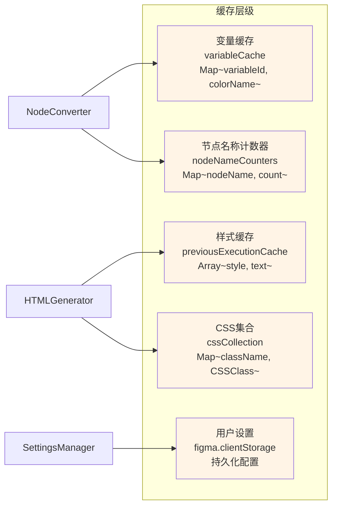
```mermaid
graph LR
    subgraph "缓存层级"
        C1[变量缓存<br/>variableCache<br/>Map~variableId, colorName~]
        C2[节点名称计数器<br/>nodeNameCounters<br/>Map~nodeName, count~]
        C3[样式缓存<br/>previousExecutionCache<br/>Array~style, text~]
        C4[CSS集合<br/>cssCollection<br/>Map~className, CSSClass~]
        C5[用户设置<br/>figma.clientStorage<br/>持久化配置]
    end
    
    NodeConverter --> C1
    NodeConverter --> C2
    HTMLGenerator --> C3
    HTMLGenerator --> C4
    SettingsManager --> C5
    
    style C1 fill:#fff4e6
    style C2 fill:#fff4e6
    style C3 fill:#fff4e6
    style C4 fill:#fff4e6
    style C5 fill:#fff4e6
```

## 5. 扩展性架构图

### 5.1 插件式架构

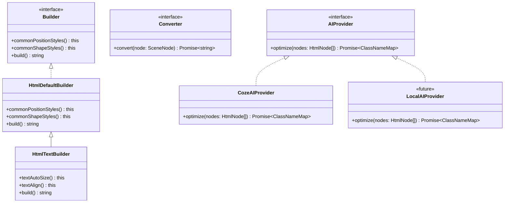
```mermaid
classDiagram
    class Builder {
        <<interface>>
        +commonPositionStyles() this
        +commonShapeStyles() this
        +build() string
    }
    
    class Converter {
        <<interface>>
        +convert(node: SceneNode) Promise~string~
    }
    
    class AIProvider {
        <<interface>>
        +optimize(nodes: HtmlNode[]) Promise~ClassNameMap~
    }
    
    class HtmlDefaultBuilder {
        +commonPositionStyles() this
        +commonShapeStyles() this
        +build() string
    }
    
    class HtmlTextBuilder {
        +textAutoSize() this
        +textAlign() this
        +build() string
    }
    
    class CozeAIProvider {
        +optimize(nodes: HtmlNode[]) Promise~ClassNameMap~
    }
    
    class LocalAIProvider {
        <<future>>
        +optimize(nodes: HtmlNode[]) Promise~ClassNameMap~
    }
    
    Builder <|.. HtmlDefaultBuilder
    HtmlDefaultBuilder <|-- HtmlTextBuilder
    AIProvider <|.. CozeAIProvider
    AIProvider <|.. LocalAIProvider
```

### 5.2 框架扩展架构

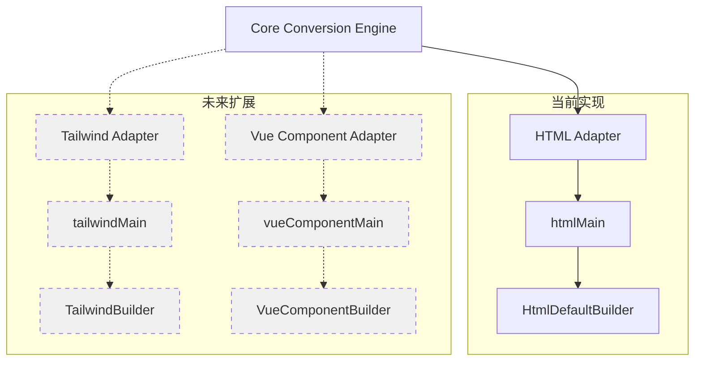
```mermaid
graph TB
    subgraph "当前实现"
        HTML[HTML Adapter]
        HTMLMain[htmlMain]
        HTMLBuilder[HtmlDefaultBuilder]
        
        HTML --> HTMLMain
        HTMLMain --> HTMLBuilder
    end
    
    subgraph "未来扩展"
        Tailwind[Tailwind Adapter]
        TailwindMain[tailwindMain]
        TailwindBuilder[TailwindBuilder]
        
        Vue[Vue Component Adapter]
        VueMain[vueComponentMain]
        VueBuilder[VueComponentBuilder]
        
        Tailwind -.-> TailwindMain
        TailwindMain -.-> TailwindBuilder
        
        Vue -.-> VueMain
        VueMain -.-> VueBuilder
    end
    
    Core[Core Conversion Engine] --> HTML
    Core -.-> Tailwind
    Core -.-> Vue
    
    style Tailwind fill:#f0f0f0,stroke-dasharray: 5 5
    style TailwindMain fill:#f0f0f0,stroke-dasharray: 5 5
    style TailwindBuilder fill:#f0f0f0,stroke-dasharray: 5 5
    style Vue fill:#f0f0f0,stroke-dasharray: 5 5
    style VueMain fill:#f0f0f0,stroke-dasharray: 5 5
    style VueBuilder fill:#f0f0f0,stroke-dasharray: 5 5
```

## 6. 安全架构图

### 6.1 沙箱隔离

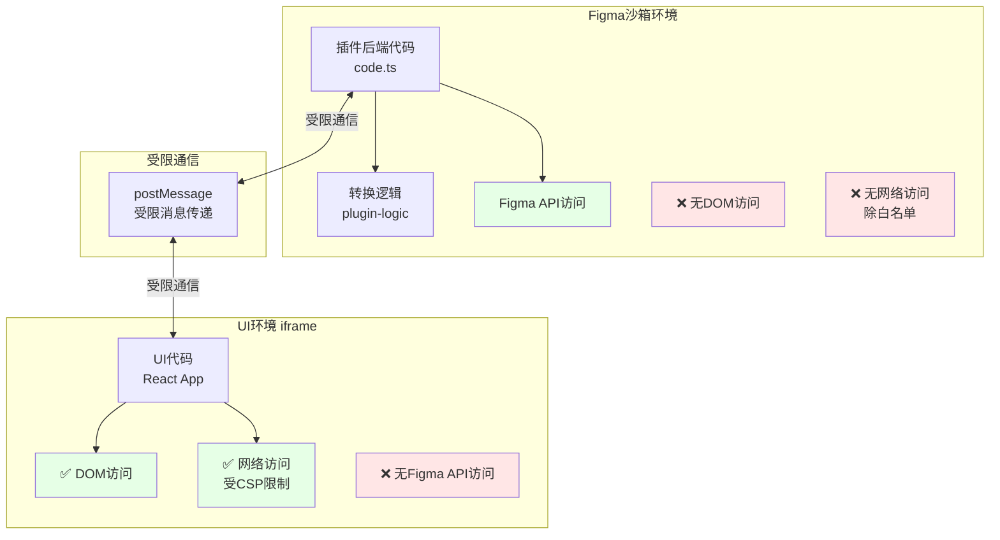
```mermaid
graph TB
    subgraph "Figma沙箱环境"
        Backend[插件后端代码<br/>code.ts]
        Logic[转换逻辑<br/>plugin-logic]
        FigmaAPI[Figma API访问]
        
        Backend --> Logic
        Backend --> FigmaAPI
        
        NoDOM[❌ 无DOM访问]
        NoNetwork[❌ 无网络访问<br/>除白名单]
    end
    
    subgraph "受限通信"
        PostMessage[postMessage<br/>受限消息传递]
    end
    
    subgraph "UI环境 iframe"
        UICode[UI代码<br/>React App]
        DOM[✅ DOM访问]
        Network[✅ 网络访问<br/>受CSP限制]
        
        UICode --> DOM
        UICode --> Network
        
        NoFigmaAPI[❌ 无Figma API访问]
    end
    
    Backend <-->|受限通信| PostMessage
    PostMessage <-->|受限通信| UICode
    
    style NoDOM fill:#ffe6e6
    style NoNetwork fill:#ffe6e6
    style NoFigmaAPI fill:#ffe6e6
    style DOM fill:#e6ffe6
    style Network fill:#e6ffe6
    style FigmaAPI fill:#e6ffe6
```

### 6.2 网络访问控制

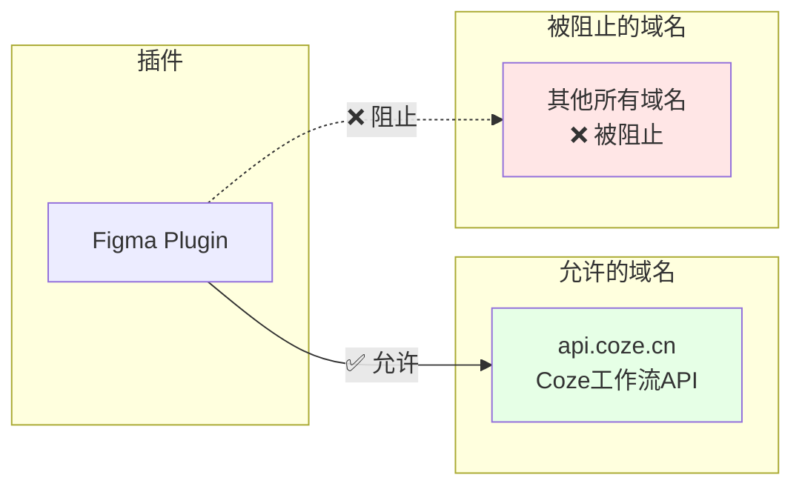
```mermaid
graph LR
    subgraph "插件"
        Plugin[Figma Plugin]
    end
    
    subgraph "允许的域名"
        Coze[api.coze.cn<br/>Coze工作流API]
    end
    
    subgraph "被阻止的域名"
        Other[其他所有域名<br/>❌ 被阻止]
    end
    
    Plugin -->|✅ 允许| Coze
    Plugin -.->|❌ 阻止| Other
    
    style Coze fill:#e6ffe6
    style Other fill:#ffe6e6
```

## 7. 部署架构图

### 7.1 构建流程

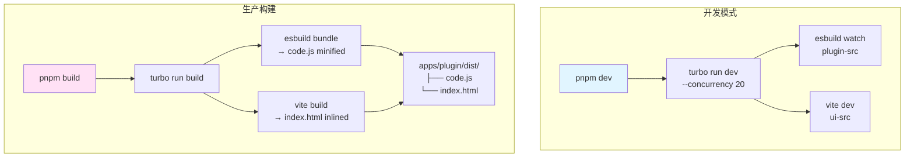
```mermaid
graph TB
    subgraph "开发模式"
        Dev[pnpm dev]
        TurboDev[turbo run dev<br/>--concurrency 20]
        ESBuildWatch[esbuild watch<br/>plugin-src]
        ViteDev[vite dev<br/>ui-src]
        
        Dev --> TurboDev
        TurboDev --> ESBuildWatch
        TurboDev --> ViteDev
    end
    
    subgraph "生产构建"
        Build[pnpm build]
        TurboBuild[turbo run build]
        ESBuildBundle[esbuild bundle<br/>→ code.js minified]
        ViteBuild[vite build<br/>→ index.html inlined]
        Dist[apps/plugin/dist/<br/>├── code.js<br/>└── index.html]
        
        Build --> TurboBuild
        TurboBuild --> ESBuildBundle
        TurboBuild --> ViteBuild
        ESBuildBundle --> Dist
        ViteBuild --> Dist
    end
    
    style Dev fill:#e1f5ff
    style Build fill:#ffe1f5
```

### 7.2 发布流程

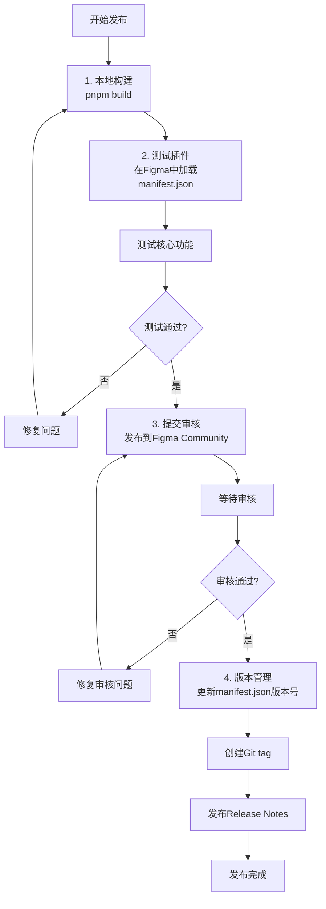
```mermaid
graph TB
    Start[开始发布] --> LocalBuild[1. 本地构建<br/>pnpm build]
    LocalBuild --> Test[2. 测试插件<br/>在Figma中加载manifest.json]
    Test --> TestCore[测试核心功能]
    TestCore --> Decision{测试通过?}
    
    Decision -->|否| Fix[修复问题]
    Fix --> LocalBuild
    
    Decision -->|是| Submit[3. 提交审核<br/>发布到Figma Community]
    Submit --> Review[等待审核]
    Review --> Approved{审核通过?}
    
    Approved -->|否| FixReview[修复审核问题]
    FixReview --> Submit
    
    Approved -->|是| Version[4. 版本管理<br/>更新manifest.json版本号]
    Version --> GitTag[创建Git tag]
    GitTag --> Release[发布Release Notes]
    Release --> End[发布完成]
```

## 8. 监控与调试架构图

### 8.1 性能监控

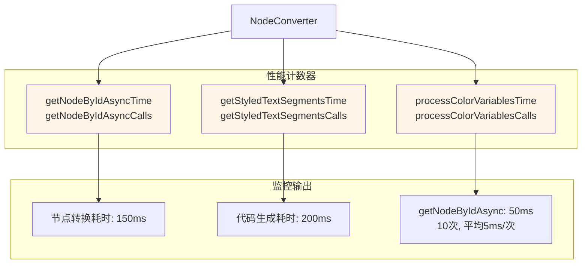
```mermaid
graph TB
    subgraph "性能计数器"
        Counter1[getNodeByIdAsyncTime<br/>getNodeByIdAsyncCalls]
        Counter2[getStyledTextSegmentsTime<br/>getStyledTextSegmentsCalls]
        Counter3[processColorVariablesTime<br/>processColorVariablesCalls]
    end
    
    subgraph "监控输出"
        Log1[节点转换耗时: 150ms]
        Log2[代码生成耗时: 200ms]
        Log3[getNodeByIdAsync: 50ms<br/>10次, 平均5ms/次]
    end
    
    NodeConverter --> Counter1
    NodeConverter --> Counter2
    NodeConverter --> Counter3
    
    Counter1 --> Log1
    Counter2 --> Log2
    Counter3 --> Log3
    
    style Counter1 fill:#fff4e6
    style Counter2 fill:#fff4e6
    style Counter3 fill:#fff4e6
```

### 8.2 调试工具架构

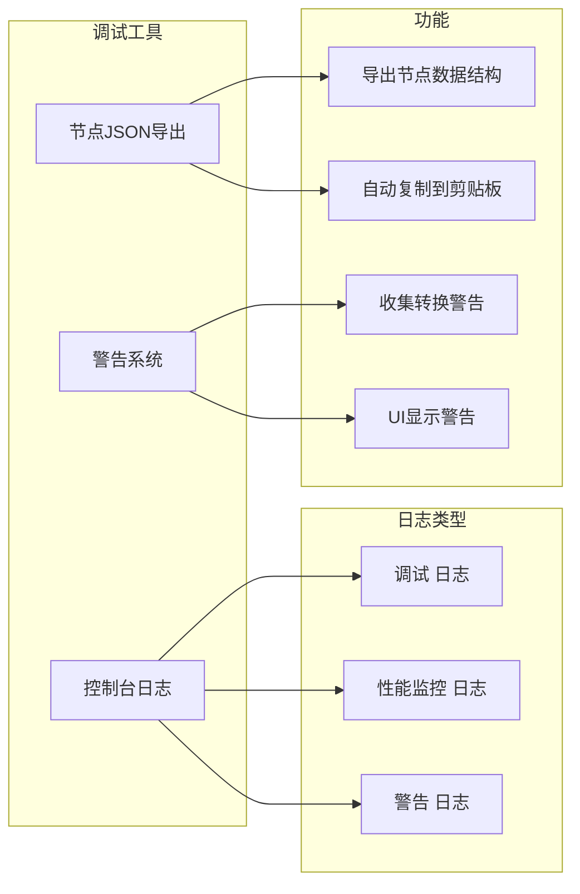
```mermaid
graph LR
    subgraph "调试工具"
        Console[控制台日志]
        NodeJSON[节点JSON导出]
        Warning[警告系统]
    end
    
    subgraph "日志类型"
        Debug[调试 日志]
        Perf[性能监控 日志]
        Warn[警告 日志]
    end
    
    subgraph "功能"
        Export[导出节点数据结构]
        Copy[自动复制到剪贴板]
        Collect[收集转换警告]
        Display[UI显示警告]
    end
    
    Console --> Debug
    Console --> Perf
    Console --> Warn
    
    NodeJSON --> Export
    NodeJSON --> Copy
    
    Warning --> Collect
    Warning --> Display
```

## 9. 系统结构图

### 9.1 技术栈结构

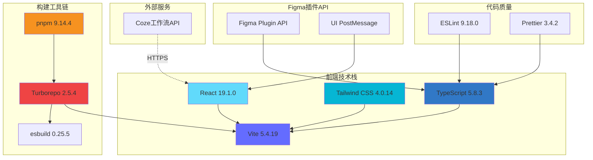
```mermaid
graph TB
    subgraph "前端技术栈"
        React[React 19.1.0]
        Vite[Vite 5.4.19]
        Tailwind[Tailwind CSS 4.0.14]
        TypeScript[TypeScript 5.8.3]
        
        React --> Vite
        Tailwind --> Vite
        TypeScript --> Vite
    end
    
    subgraph "构建工具链"
        PNPM[pnpm 9.14.4]
        Turbo[Turborepo 2.5.4]
        ESBuild[esbuild 0.25.5]
        
        PNPM --> Turbo
        Turbo --> ESBuild
        Turbo --> Vite
    end
    
    subgraph "代码质量"
        ESLint[ESLint 9.18.0]
        Prettier[Prettier 3.4.2]
        
        ESLint --> TypeScript
        Prettier --> TypeScript
    end
    
    subgraph "Figma插件API"
        PluginAPI[Figma Plugin API]
        UIPostMessage[UI PostMessage]
        
        PluginAPI --> TypeScript
        UIPostMessage --> React
    end
    
    subgraph "外部服务"
        CozeAPI[Coze工作流API]
        
        CozeAPI -.->|HTTPS| React
    end
    
    style React fill:#61dafb
    style Vite fill:#646cff
    style Tailwind fill:#06b6d4
    style TypeScript fill:#3178c6
    style PNPM fill:#f69220
    style Turbo fill:#ef4444
```

### 9.2 Monorepo包依赖结构

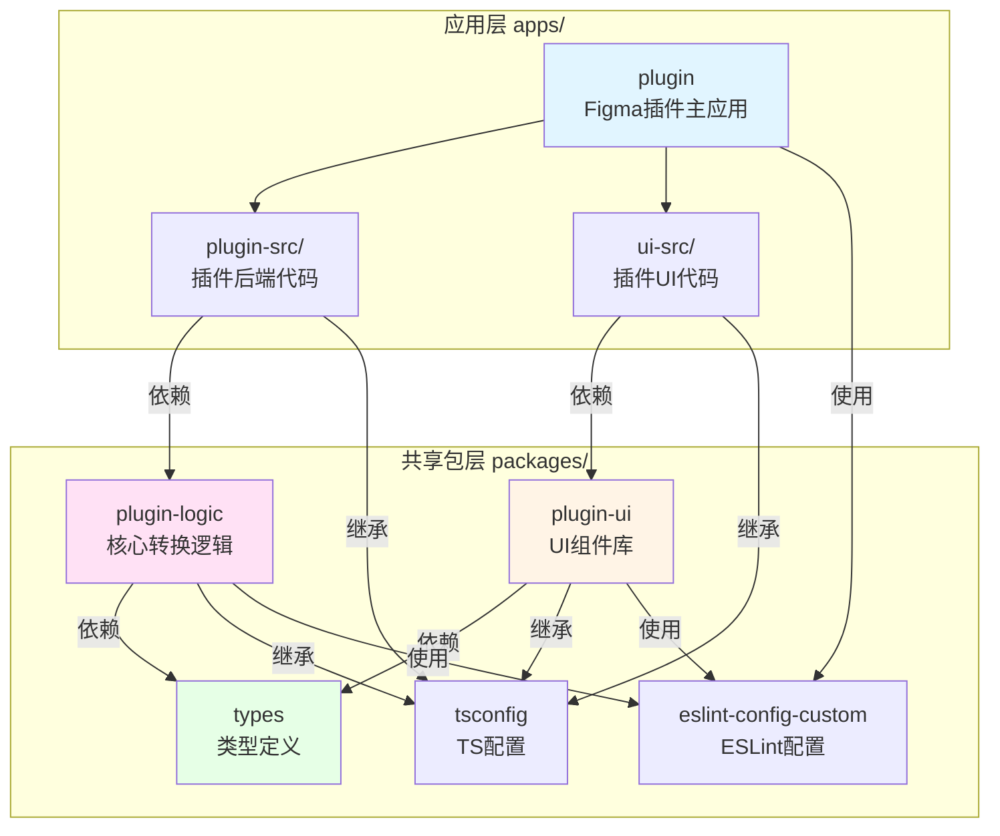
```mermaid
graph TB
    subgraph "应用层 apps/"
        Plugin[plugin<br/>Figma插件主应用]
        PluginSrc[plugin-src/<br/>插件后端代码]
        UISrc[ui-src/<br/>插件UI代码]
        
        Plugin --> PluginSrc
        Plugin --> UISrc
    end
    
    subgraph "共享包层 packages/"
        Logic[plugin-logic<br/>核心转换逻辑]
        UILib[plugin-ui<br/>UI组件库]
        Types[types<br/>类型定义]
        TSConfig[tsconfig<br/>TS配置]
        ESLintConfig[eslint-config-custom<br/>ESLint配置]
    end
    
    PluginSrc -->|依赖| Logic
    UISrc -->|依赖| UILib
    
    Logic -->|依赖| Types
    UILib -->|依赖| Types
    
    PluginSrc -->|继承| TSConfig
    UISrc -->|继承| TSConfig
    Logic -->|继承| TSConfig
    UILib -->|继承| TSConfig
    
    Plugin -->|使用| ESLintConfig
    Logic -->|使用| ESLintConfig
    UILib -->|使用| ESLintConfig
    
    style Plugin fill:#e1f5ff
    style Logic fill:#ffe1f5
    style UILib fill:#fff4e6
    style Types fill:#e6ffe6
```

### 9.3 文件系统结构

```mermaid
graph TB
    Root[figma-to-code/]
    
    Root --> Apps[apps/]
    Root --> Packages[packages/]
    Root --> Config[配置文件]
    Root --> Docs[文档]
    
    Apps --> PluginApp[plugin/]
    PluginApp --> PluginSrcDir[plugin-src/]
    PluginApp --> UISrcDir[ui-src/]
    PluginApp --> DistDir[dist/]
    
    PluginSrcDir --> CodeTS[code.ts<br/>插件入口]
    UISrcDir --> AppTSX[App.tsx<br/>UI入口]
    DistDir --> CodeJS[code.js<br/>编译后端]
    DistDir --> IndexHTML[index.html<br/>内联UI]
    
    Packages --> LogicPkg[plugin-logic/]
    Packages --> UIPkg[plugin-ui/]
    Packages --> TypesPkg[types/]
    Packages --> TSConfigPkg[tsconfig/]
    Packages --> ESLintPkg[eslint-config-custom/]
    
    LogicPkg --> Converters[converters/<br/>节点转换器]
    LogicPkg --> Builders[builders/<br/>HTML构建器]
    LogicPkg --> AI[ai/<br/>AI优化]
    
    UIPkg --> Components[components/<br/>UI组件]
    
    TypesPkg --> TypeDefs[index.d.ts<br/>类型定义]
    
    Config --> ManifestJSON[manifest.json<br/>插件清单]
    Config --> PackageJSON[package.json<br/>项目配置]
    Config --> TurboJSON[turbo.json<br/>构建配置]
    Config --> PNPMWorkspace[pnpm-workspace.yaml<br/>工作区配置]
    
    Docs --> ArchDoc[架构设计文档.md]
    Docs --> SystemDoc[系统设计文档.md]
    Docs --> UIDoc[UI设计文档.md]
    Docs --> WorkflowDoc[工作流程图.md]
    Docs --> ThisDoc[架构图与类图.md]
    
    style Root fill:#f0f0f0
    style Apps fill:#e1f5ff
    style Packages fill:#ffe1f5
    style Config fill:#fff4e6
    style Docs fill:#e6ffe6
```

### 9.4 运行时环境结构

```mermaid
graph TB
    subgraph "Figma应用环境"
        FigmaApp[Figma Desktop/Web]
        
        subgraph "插件沙箱环境"
            PluginThread[插件主线程]
            CodeJS[code.js]
            LogicLib[plugin-logic]
            FigmaAPIAccess[Figma API访问]
            
            PluginThread --> CodeJS
            CodeJS --> LogicLib
            CodeJS --> FigmaAPIAccess
        end
        
        subgraph "UI iframe环境"
            UIThread[UI线程]
            IndexHTML[index.html]
            ReactApp[React应用]
            DOMAccess[DOM访问]
            
            UIThread --> IndexHTML
            IndexHTML --> ReactApp
            ReactApp --> DOMAccess
        end
        
        FigmaApp --> PluginThread
        FigmaApp --> UIThread
    end
    
    subgraph "通信机制"
        PostMessageBackend[figma.ui.postMessage]
        PostMessageUI[parent.postMessage]
        
        PluginThread <-->|消息| PostMessageBackend
        PostMessageBackend <-->|跨域通信| PostMessageUI
        PostMessageUI <-->|消息| UIThread
    end
    
    subgraph "外部服务"
        CozeService[Coze工作流服务]
        
        ReactApp -.->|HTTPS请求| CozeService
    end
    
    style PluginThread fill:#ffe6e6
    style UIThread fill:#e6ffe6
    style PostMessageBackend fill:#fff4e6
    style PostMessageUI fill:#fff4e6
```

### 9.5 数据存储结构

```mermaid
graph TB
    subgraph "临时存储"
        Memory[内存缓存]
        VariableCache[变量缓存<br/>Map~variableId, colorName~]
        NodeNameCache[节点名称计数器<br/>Map~nodeName, count~]
        CSSCache[CSS集合<br/>Map~className, CSSClass~]
        
        Memory --> VariableCache
        Memory --> NodeNameCache
        Memory --> CSSCache
    end
    
    subgraph "持久化存储"
        ClientStorage[figma.clientStorage]
        Settings[用户设置]
        OptimizeCode[optimizeCode: boolean]
        LayerName[layerName: boolean]
        ResponsiveRoot[responsiveRoot: boolean]
        
        ClientStorage --> Settings
        Settings --> OptimizeCode
        Settings --> LayerName
        Settings --> ResponsiveRoot
    end
    
    subgraph "会话存储"
        UIState[UI状态]
        CurrentCode[当前代码]
        HTMLPreview[HTML预览]
        LoadingState[加载状态]
        Warnings[警告列表]
        Colors[颜色列表]
        
        UIState --> CurrentCode
        UIState --> HTMLPreview
        UIState --> LoadingState
        UIState --> Warnings
        UIState --> Colors
    end
    
    subgraph "导出数据"
        ClipboardData[剪贴板数据]
        VueCode[Vue3代码]
        NodeJSON[节点JSON]
        
        ClipboardData --> VueCode
        ClipboardData --> NodeJSON
    end
    
    style Memory fill:#ffe6e6
    style ClientStorage fill:#e6ffe6
    style UIState fill:#fff4e6
    style ClipboardData fill:#e1f5ff
```

## 10. 总结

本文档提供了Figma转Vue3代码插件的完整架构图和类图，涵盖：

1. **系统架构图** - 展示整体系统层次和Monorepo结构
2. **数据流架构图** - 展示完整转换流程和消息通信机制
3. **核心模块类图** - 展示节点转换、HTML生成、AI优化、UI组件的详细类结构
4. **性能优化架构图** - 展示并行处理策略和缓存架构
5. **扩展性架构图** - 展示插件式架构和框架扩展能力
6. **安全架构图** - 展示沙箱隔离和网络访问控制
7. **部署架构图** - 展示构建流程和发布流程
8. **监控与调试架构图** - 展示性能监控和调试工具
9. **系统结构图** - 展示技术栈、包依赖、文件系统、运行时环境和数据存储结构

这些架构图为开发者提供了清晰的系统全貌，便于理解、维护和扩展插件功能。